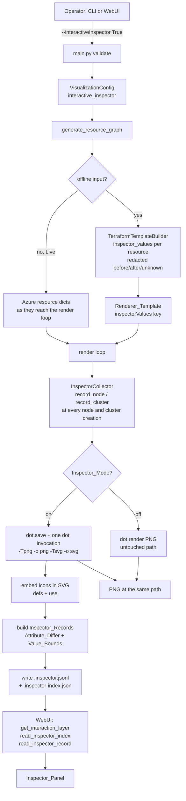
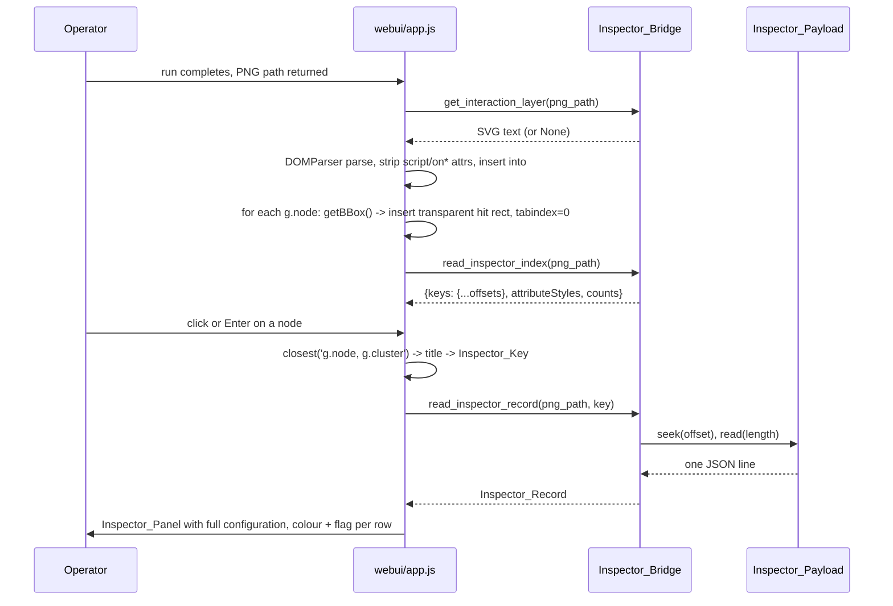
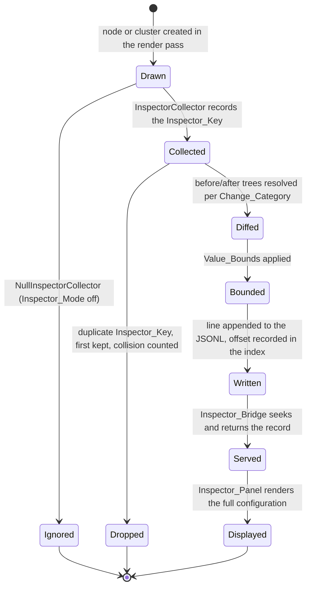

# Design Document

## Overview

This feature makes a rendered CloudHorus diagram clickable and opens a side panel that shows the **full configuration** of the selected resource, with per-attribute colour coding for what the Terraform plan adds, removes, or changes. It layers on the shipped `terraform-plan-diff-visualization` feature and reuses its Glossary, its Change_Category set, its Change_Style colour tokens, and its Change_Surface concept.

The whole feature sits behind one trailing, defaulted CLI argument (`--interactiveInspector`, default `False`). With the argument absent, the code path is the one that ships today, byte for byte: the headless CLI/pipeline use case is a first-class mode, not a degraded one.

### The four grounded facts that shape the design

1. **The viewer is a flat raster.** `webui/app.js` `showImage()` fetches a base64 PNG through the pywebview bridge method `get_image_base64` into ``; `initPanZoom()` pans by scrolling `#viewer-canvas` and `zoomIn/zoomOut/zoomReset` write `img.style.transform = scale(...)`. A PNG carries no per-resource identity, so an interaction layer has to come from somewhere else.
2. **Attribute detail dies at the builder boundary.** `LocalTemplateResource` (src/cloudhorus/models/local_template_document.py) has a `raw_values` field, filled by `terraform_builder._normalize_resource` (line 908), but `to_renderer_resource()` emits only `type`, `name`, `properties`, optional `dependsOn`, the `extra_fields`, and `changeCategory`. `raw_values` never reaches the renderer template, so the inspector needs a new, opt-in carrier.
3. **The plan already holds both sides and the sensitivity masks.** `resource_changes[].change.before` / `.after` hold the pre- and post-apply attribute trees, `before_sensitive` / `after_sensitive` (with a fallback to the planned resource's `sensitive_values`) mark the sensitive leaves, and `TerraformTemplateBuilder._sensitive_indexes` / `_sensitive_mask_for` / `_redact_sensitive` already index change objects by address and walk a value tree in parallel with its mask, writing the literal `(sensitive)`. The inspector reuses all three rather than re-implementing redaction.
4. **A sidecar precedent exists and works.** Plan_Diff_Mode writes `azure_resources_<timestamp>.change-summary.json` beside the PNG through `write_change_summary_sidecar`, and `cloudhorus_webui.read_change_summary(png_path)` reads it back for the filter chips. The Inspector_Payload follows the same shape of solution — files beside the diagram, read on demand through a bridge method.

### Spike: how the diagram becomes clickable

Two mechanisms were considered. Both were measured against the installed Graphviz before the design committed to either. Environment: `dot - graphviz version 2.43.0 (0)`, Python `graphviz` library 0.21, Python 3.12.8, project venv at `.venv`.

Test graph: nested `cluster_vnet…` / `cluster_subnet…` clusters, `splines=ortho`, three `shape=none` nodes, two of them carrying `image=` + `imagescale` + `imagepos=tc` + `labelloc=b`, one carrying a decorated HTML `<TABLE>` label with a Change_Style border and Flag_Token — i.e. the shapes this codebase actually emits.

| Measurement | Command | Result |
| --- | --- | --- |
| PNG from the Python library (today's path) | `graphviz.Source(...).render('big_lib', format='png')` | md5 `ee9f8fc31cf8c130ff358868eef862dd` |
| PNG from a single-format CLI render | `dot -Kdot -Tpng -obig_single.png big.gv` | md5 `ee9f8fc31cf8c130ff358868eef862dd` — identical |
| **PNG + SVG from one invocation** | `dot -Kdot -Tpng -obig_dual.png -Tsvg -obig_dual.svg big.gv` | md5 `ee9f8fc31cf8c130ff358868eef862dd` — **identical to both of the above** |
| SVG determinism across invocations | `dot -Kdot -Tsvg` run twice, `cmp` | byte-identical |
| Node identity in the SVG | — | `<g id="node1" class="node"><title>web&#45;rg1</title>` — the Graphviz node id, XML-escaped |
| Cluster identity in the SVG | — | `<g id="clust1" class="cluster"><title>cluster_vnetcore</title>` |
| Image map without `href` | `dot -Tcmapx -ocm.map` | `<map id="G" name="G"></map>` — **empty** |
| Image map with `href` added to one node | same, after injecting `href="ch://db-rg1"` | one `<area shape="rect" … coords="211,107,283,155"/>`; PNG md5 unchanged |

Three conclusions, all measured rather than assumed:

- **A single Graphviz invocation can emit the PNG and the SVG from one layout pass, and the PNG is byte-identical to the PNG the current code path produces.** That is what lets Requirement 3.1 (one layout pass) and Requirement 1.6 (same PNG as a headless run) hold simultaneously.
- **`-Tcmapx` produces nothing unless every node carries an `href`.** Adding `href` does not change the PNG raster (same md5), so the blocker is not visual — it is that the shared DOT source would have to be mutated for every run, and that DOT source is also what `graph_generator` writes to `<diagram>.dot` and feeds to `graphviz2drawio`. Plus the map coordinates would then have to be reconciled with the existing CSS `transform: scale()` and the scroll-pan container on every zoom step.
- **The SVG needs no DOT change at all.** `<title>` already carries the Node_Key and the Cluster_Key, so identity is free, zoom stays crisp, and the label text becomes selectable and searchable.

**Decision: SVG alongside the PNG, from one invocation.** The image-map route stays in the decision log as the documented fallback.

### Spike: icon embedding

Graphviz writes icons into the SVG as absolute filesystem references: `<image xlink:href="/home/hfellah/ch/CloudHorus/icons/Table.png" width="108px" height="108px" preserveAspectRatio="xMinYMin meet" x="150" y="-180"/>`. Inlined into the WebUI document that path does not resolve portably (a WSL path in a Windows-hosted webview, an absolute path under a `file://` origin), and a diagram repeats the same icon dozens of times, so a naive data-URI substitution inflates the file.

Three embedding variants were rendered with librsvg (ImageMagick's SVG delegate, `XML 2.9.10`) and compared pixel by pixel:

| Variant | SVG size (2 instances, 1 icon) | Render vs. per-instance data URI |
| --- | --- | --- |
| Per-instance data URI | 23 055 B | baseline |
| `<defs><symbol>` + `<use>` | — | **differs** — `<use>` width/height did not size the symbol as intended |
| `<defs><image id>` + `<use x y>` | 12 958 B | `compare -metric AE` = **0**, i.e. pixel-identical |

**Decision: one `<image>` per distinct (icon path, width, height, preserveAspectRatio) group inside `<defs>`, each occurrence rewritten to `<use xlink:href="#ch-icon-N" x=… y=…/>`.** The `<use>` element only translates, which is exactly what SVG 1.1 guarantees for a referenced `<image>`, and the measurement confirms the rendering is unchanged. `<symbol>` is rejected on evidence.

### Non-breaking strategy

| Concern | Strategy |
| --- | --- |
| Headless PNG identity | With Inspector_Mode off, `dot.render(output_filename, format="png")` is executed unchanged. Nothing about the DOT source, the node attributes, or the render call depends on the inspector. |
| Renderer_Template identity | The inspector value carrier is a new trailing, defaulted field on `LocalTemplateResource` that `to_renderer_resource()` emits only when it is not `None` — the exact discipline `change_category` already follows. |
| CLI compatibility | One new argument, `--interactiveInspector` (`type=str`, `default="False"`), matching the existing `--exportDrawio` shape. No existing argument changes name, arity, or default. |
| Failure containment | Every inspector step is wrapped so that a failure downgrades to a warning and the run still returns the PNG path (Requirement 1.9). The diagram is never lost to a failure in the new feature. |
| Sensitive data | Redaction happens in the builder, before any value is written to the Inspector_Payload — the payload is downstream of `_redact_sensitive`, never upstream. |
| Payload size | Index + JSONL with byte offsets: the bridge reads the index once and then seeks directly to the requested record, so opening one resource never loads the other 4 999. |

## Architecture

### Where the new code lives

```
src/core/
  inspector.py            ← NEW  attribute flattening, Attribute_Differ, Value_Bounds,
                                 InspectorCollector, index/JSONL writers, SVG post-processing
  terraform_builder.py    ← EXTENDED  optional inspector value extraction (before/after/unknown)
  graph_generator.py      ← EXTENDED  inspector collection at node/cluster creation, dual-format
                                      render branch, payload write
src/cloudhorus/models/
  local_template_document.py ← EXTENDED  optional inspector_values field
  configuration.py           ← EXTENDED  interactive_inspector field
src/cloudhorus/services/
  graph_generator_service.py ← EXTENDED  interactive_inspector passthrough
src/main.py                  ← EXTENDED  --interactiveInspector + validation
cloudhorus_webui.py          ← EXTENDED  get_interaction_layer, read_inspector_index,
                                         read_inspector_record, --interactiveInspector marshalling
webui/index.html             ← EXTENDED  inspector toggle, SVG stage, inspector panel markup
webui/app.js                 ← EXTENDED  SVG inlining, hit rects, selection, panel rendering
webui/styles.css             ← EXTENDED  panel and attribute-row styling
```

`src/core/inspector.py` is deliberately dependency-light: no Graphviz, no Azure SDK, no pywebview. It takes dictionaries and returns dictionaries, which is what makes the property tests cheap.

### End-to-end flow



### Selection sequence in the WebUI



### Decision log

| Decision | Alternatives considered | Rationale (with evidence) |
| --- | --- | --- |
| SVG interaction layer produced by one dual-format `dot` invocation | `-Tcmapx` image map over the PNG; `-Tjson` bounding boxes + DOM hotspots; a second `dot -Tsvg` pass after the untouched `dot.render` | Measured: the dual-format PNG is byte-identical to both the current library render and a single-format CLI render (md5 `ee9f8fc31cf8c130ff358868eef862dd`), so one layout pass serves both artifacts. `-Tcmapx` emits an empty map unless `href` is injected into every node, which would mutate the DOT that also feeds `<diagram>.dot` and `graphviz2drawio`, and its coordinates would need reconciling with the existing CSS scale and scroll pan on every zoom step. A second `dot -Tsvg` pass was rejected on cost: layout is the expensive phase, and doubling it would blow the 15 percent overhead bound of Requirement 12.6 on a large plan. |
| Inspector_Mode off leaves `dot.render(...)` untouched | Always route through the subprocess, since the bytes match anyway | Byte-identity by construction beats byte-identity by measurement for the mode the pipeline depends on. Only the opt-in branch takes the new code path. |
| Icons embedded as `<defs><image id>` + `<use x y>`, grouped by (path, width, height, preserveAspectRatio) | Per-instance data URI; `<defs><symbol>` + `<use>`; leave the absolute `xlink:href` | `<symbol>` misrendered under librsvg. The `<defs><image>` + `<use>` variant rendered pixel-identically to per-instance data URIs (`compare -metric AE` = 0) at 56 percent of the size for a single repeated icon; the saving grows with the diagram. Leaving absolute paths breaks under a Windows-hosted webview reading a WSL path. |
| Hit rects synthesized client-side from `getBBox()` | Compute them in Python from `-Tjson` `pos`/`width`/`height`; rely on `pointer-events: bounding-box` | Graphviz emits `polygon fill="none"` for `shape=none` nodes, so a click inside a node's whitespace passes straight through to the cluster polygon underneath — the node needs a real hit area. `getBBox()` is measured by the engine that will actually render the text, so it cannot disagree with what the Operator sees; `pointer-events: bounding-box` is SVG 2 and not dependable across WebKitGTK and WebView2. `-Tjson` stays the documented fallback: the spike confirmed it exposes node `pos`, `width`, `height` and cluster `bb`. |
| Inspector_Payload as one JSONL file plus an offset index | One JSON blob for the whole run; one file per resource; embed the data in the SVG | Requirement 12.1 wants a single-record read. An offset index gives O(1) seek with two small files, keeps the output folder tidy (the change-summary sidecar precedent is one file), and stays trivially round-trippable for the property test. One file per resource would litter the folder with hundreds of entries; a single blob would load 5 000 records to show one. |
| Inspector values carried on a new optional `inspector_values` field, emitted as `inspectorValues` only when set | Extend `raw_values` into the renderer contract unconditionally; a side channel keyed by `(name, type)` in `metadata` | Emitting `raw_values` unconditionally would change the Renderer_Template for every offline run and break the legacy-parity property of the plan-diff spec. The optional field repeats the `change_category` discipline that is already proven in this codebase. |
| Records collected at the node and cluster **creation** sites | Derive records from the Renderer_Template after the fact | Collecting where `add_node_in_subgraph` and the `cluster_vnet…` / `cluster_subnet…` subgraphs are created guarantees that the Inspector_Index covers exactly the elements the Interaction_Layer carries (Requirement 14.5) and that Skip_Filtered resources are absent (Requirement 4.6) — no second, divergent notion of "displayed". |
| A null collector object when Inspector_Mode is off | `if inspector_enabled:` guards at each call site | The call sites are 8–10 levels deep inside `_generate_resource_graph_inner`. A no-op method keeps each edit to a single line and keeps the disabled path free of new branching. |
| Attribute diffing on flattened leaf paths | Structural tree diff with nested rendering | A flat `Attribute_Path → (before, after, state)` list is what the panel renders, sorts, bounds, and filters, and it makes the differ a pure function over two dictionaries — cheap to generate inputs for and easy to state properties about (totality, path coverage, symmetry). |
| Redaction reused from `TerraformTemplateBuilder` | A second redaction pass inside `inspector.py` | One implementation, one place to get wrong. `_redact_sensitive` is already property-tested by the plan-diff spec (Property 19); the inspector consumes its output. |
| Requirement 1.8 asserted as converter-input byte equality, exact geometry equality, and structural equality — but not as whole-file `.drawio` byte equality | Assert whole-file byte equality, now that the export geometry is stable | The converter is unreproducible for two independent reasons and only one has been removed. The layout was one: `graphviz2drawio.convert` re-lays the graph out through pygraphviz, which placed one subnet container at x=2276, 1828, 2047 and 2495 across four calls of identical input, with the containers swapping sides. `apply_authoritative_geometry` removes that by reading the layout from `dot -Tdot` and writing it onto the cells after conversion, so geometry is now a function of the DOT alone and is compared exactly, keyed by cell label. The serialisation is the other: the converter still numbers the `clustN` / `nodeN` cells in a varying order and its attribute escaping varies with it, so two exports of one input diverge at byte 490 (an `&` against a `"`) with byte-identical DOT on both sides. A whole-file byte compare therefore still measures the converter, not CloudHorus. One pair of runs did come out byte-identical during the investigation, which the varying numbering makes possible and which is why a single measurement was not taken as evidence. |
| Every `add_node_in_subgraph` site records, and a sourceless record is dropped | Leave the lookup-drawn nodes uncovered, and narrow Requirement 3.2 to resource-derived nodes | Requirement 3.2 asks for an activatable element per resource drawn as a node, and the private-DNS-zone, Bastion, route-table and NSG nodes are drawn from lookups rather than from a Renderer_Template entry, so the first four call sites left them undescribed — activatable in the layer with nothing behind them. Instrumenting all eight sites closes that. The aggregated `PrivateDNSZones-<vnet>` node has no single source resource, so its source is synthesized from the VNet's zone list. Where no source resolves and none can be synthesized — a live-mode lookup subject absent from the exported resource list — the record is dropped instead, because the panel gates activatability on the Inspector_Index key set, so an identity-only record would give the Operator a clickable element and an empty panel. One guard in `InspectorCollector._record`, which every call site already funnels through. |

## Components and Interfaces

### 1. `src/core/inspector.py` (new)

```python
ATTRIBUTE_STATES: tuple[str, ...] = ("added", "removed", "changed", "unchanged")

ATTRIBUTE_STYLES: dict[str, AttributeStyle] = {
    "added":     AttributeStyle(color="#107C10", flag="+", label="Added"),
    "removed":   AttributeStyle(color="#D13438", flag="-", label="Removed"),
    "changed":   AttributeStyle(color="#0078D4", flag="~", label="Changed"),
    "unchanged": None,      # default text colour, no flag
}

MAX_ATTRIBUTE_ROWS = 500       # Requirement 12.2
MAX_SCALAR_CHARS = 2048        # Requirement 12.3
MAX_TREE_DEPTH = 12            # Requirement 12.4
TRUNCATION_MARKER = "(truncated)"
UNKNOWN_MARKER = "(known after apply)"

def flatten_values(tree: Any, *, max_depth: int = MAX_TREE_DEPTH) -> dict[str, Any]:
    """Flatten a value tree into {Attribute_Path: scalar}. Dict keys join with '.',
    list indices join as '.0'. A branch deeper than max_depth collapses to TRUNCATION_MARKER."""

def render_scalar(value: Any, *, max_chars: int = MAX_SCALAR_CHARS) -> str:
    """Render one leaf as display text, truncating past max_chars with TRUNCATION_MARKER."""

def diff_attributes(before: Any, after: Any, *, unknown: Any = None) -> list[AttributeEntry]:
    """Attribute_Differ. One AttributeEntry per Attribute_Path present in either tree,
    sorted by Attribute_Path, each with exactly one Attribute_State."""

def apply_bounds(entries: list[AttributeEntry]) -> tuple[list[AttributeEntry], int]:
    """Return (kept entries, omitted count). Under the row cap the input order is
    preserved untouched; over the cap, non-unchanged entries are kept first and the
    remainder is filled in Attribute_Path order."""

def build_record(identity: InspectorIdentity, before, after, unknown) -> InspectorRecord: ...

class InspectorCollector:
    """Collects one entry per drawn diagram element. Enabled instance only."""
    def record_node(self, node_key: str, resource: Mapping, resource_group: str) -> None: ...
    def record_cluster(self, cluster_key: str, kind: str, source: Mapping,
                       resource_group: str) -> None: ...
    def build_payload(self) -> InspectorPayload: ...

class NullInspectorCollector(InspectorCollector):
    """No-op used when Inspector_Mode is off; every method returns immediately."""

def write_inspector_payload(payload: InspectorPayload, output_filename: str) -> Optional[str]:
    """Write <diagram>.inspector.jsonl and <diagram>.inspector-index.json.
    Returns the index path, or None after logging a warning on failure."""

def embed_svg_icons(svg_text: str, *, read_icon: Callable[[str], bytes]) -> str:
    """Rewrite every <image> into <use> and hoist one <image> per distinct
    (href, width, height, preserveAspectRatio) group into <defs> as a data URI."""
```

`InspectorCollector.record_node` stores the Node_Key, the identity fields, and a reference to the resource dict. On a duplicate Node_Key it keeps the first, logs a warning, and increments a collision counter surfaced in the index (Requirement 4.5).

### 2. `src/core/terraform_builder.py` (extended)

One new keyword argument and one new private helper. Signatures stay source-compatible.

```python
def build_document_from_json(
    self,
    terraform_json: Dict[str, Any],
    change_model: Optional[ChangeModel] = None,
    collect_inspector_values: bool = False,       # NEW, trailing, defaulted
) -> LocalTemplateDocument: ...

def build_terraform_template(
    self,
    terraform_json_file: str,
    output_file: Optional[str] = None,
    change_types: Optional[Sequence[str]] = None,
    collect_inspector_values: bool = False,       # NEW, trailing, defaulted
) -> Optional[str]: ...

def _inspector_values_for(self, terraform_json, resource, category) -> Optional[Dict[str, Any]]:
    """Resolve the redacted {before, after, afterUnknown} triple of one address."""
```

`_inspector_values_for` reuses the existing machinery rather than adding a parallel path:

- `self._sensitive_indexes(terraform_json)` already returns `changes_by_address`, mapping an address to its `change` object — that is where `before`, `after`, and `after_unknown` live.
- `before` is redacted with `self._redact_sensitive(before, self._sensitive_mask_for(tf, address, "before"))`; `after` with the `"after"` mask, which already falls back to the planned resource's `sensitive_values`.
- The before/after resolution per Change_Category (Requirement 6):

| Change_Category | before tree | after tree |
| --- | --- | --- |
| `create` | `{}` | redacted `change.after` |
| `delete` | redacted `change.before` | `{}` |
| `update` | redacted `change.before` | redacted `change.after` |
| `replace` | redacted `change.before` | redacted `change.after`, record flagged `"replacement": true` |
| `unchanged` | redacted resource `values` | the same redacted `values` |
| no `change` object at all | redacted resource `values` | the same tree, warning logged with the address |

- `after_unknown` is carried through untouched (it is a boolean mask, never a value) and consumed by `diff_attributes` to render `(known after apply)` (Requirement 6.6).

When `collect_inspector_values` is `False` the helper is never called and `LocalTemplateResource.inspector_values` stays `None`, so `to_renderer_resource()` emits exactly the keys it emits today.

### 3. `src/cloudhorus/models/local_template_document.py` (extended)

```python
@dataclass
class LocalTemplateResource:
    ...                                          # existing fields, same order
    change_category: Optional[str] = None
    inspector_values: Optional[Dict[str, Any]] = None    # NEW, trailing, defaulted

    def to_renderer_resource(self) -> Dict[str, Any]:
        ...
        if self.change_category is not None:
            resource["changeCategory"] = self.change_category
        if self.inspector_values is not None:               # NEW
            resource["inspectorValues"] = self.inspector_values
        return resource
```

Trailing and defaulted, emitted only when set: every existing construction site compiles unchanged and every legacy Renderer_Template is key-for-key identical.

### 4. `src/core/graph_generator.py` (extended)

Five additive touch points, mirroring how the plan-diff feature was threaded through this file.

1. **Signature** — `interactive_inspector: bool = False` appended to `generate_resource_graph` and `_generate_resource_graph_inner`, forwarded to `build_terraform_template(..., collect_inspector_values=interactive_inspector)`.
2. **Collector construction** — one local, next to the existing `change_index` / `aggregate_counts` block:
   ```python
   inspector = InspectorCollector() if interactive_inspector else NullInspectorCollector()
   ```
3. **Collection at creation sites** — a single line beside each element the diagram actually draws:
   - the resource-group level node (`add_node_in_subgraph(resource_group, resource_name + "-" + resourceGroup, ...)`) → `inspector.record_node(f"{resource_name}-{resourceGroup}", resource, resourceGroup)`;
   - the subnet-placed node (`add_node_in_subgraph(subnet_subgraph, node_id, ...)`) → `inspector.record_node(node_id, resource, resourceGroup)`;
   - the `cluster_vnet<name>` subgraph → `inspector.record_cluster(f"cluster_vnet{resource_name}", "virtualNetwork", resource, resourceGroup)`;
   - the `cluster_subnet<name>` subgraphs (four sites, all already funnelled through `style_subnet_cluster`) → `inspector.record_cluster(f"cluster_subnet{subnet_name}", "subnet", subnet_entry, resourceGroup)`, where `subnet_entry` is the entry from the parent VNet's `properties["subnets"]` when the Renderer_Template carries no standalone subnet resource (Requirement 9.5).

   In Live mode the `resource` in scope is the Azure resource dict, so the same call serves both families and no Azure call is added (Requirement 10.5).
4. **Render branch** — the only place the render call changes, and only in the enabled branch:
   ```python
   if not interactive_inspector:
       dot.render(output_filename, format="png")            # today's path, untouched
   else:
       dot.save(output_filename)                            # same source file render would write
       svg_path = f"{output_filename}.svg"
       subprocess.run([DOT_BINARY, "-Kdot",
                       "-Tpng", "-o", f"{output_filename}.png",
                       "-Tsvg", "-o", svg_path,
                       output_filename], check=True)
       write_svg_with_embedded_icons(svg_path)               # embed_svg_icons + atomic replace
   ```
   The subprocess argument list is a fixed vector with the paths passed as separate elements, never a shell string, so a resource name that reaches a filename cannot inject a command. A `CalledProcessError`, a missing `dot`, or an icon-read failure downgrades to a warning and falls back to `dot.render(output_filename, format="png")`, so the PNG is produced either way (Requirements 1.9, 3.8).
5. **Payload write** — beside the existing `write_change_summary_sidecar` call:
   ```python
   if interactive_inspector:
       write_inspector_payload(inspector.build_payload(), output_filename)
   ```
   Wrapped so a write failure is a warning only.

### 5. `src/main.py` (extended)

```python
parser.add_argument(
    "--interactiveInspector",
    type=str,
    default="False",
    help="Produce the interactive SVG layer and the per-resource configuration payload "
         "beside the PNG diagram (True/False). The PNG is unchanged either way.",
)
```

Validation, added to the existing argument-checking block: the raw value is compared case-insensitively against `{"true", "false"}`; anything else logs `Invalid --interactiveInspector value '<value>'. Accepted values: True False` and exits non-zero (Requirement 2.3). This is intentionally stricter than `--exportDrawio`, which routes through `str_to_bool` and silently treats an unrecognized value as `False`; the existing argument keeps its behaviour, so nothing regresses.

`VisualizationConfig` gains `interactive_inspector: bool = False` and `GraphGeneratorService.generate_graph` gains the same trailing defaulted parameter.

### 6. `cloudhorus_webui.py` (extended)

Three new bridge methods, following the `read_change_summary` pattern (path derived from the PNG path, missing file returns `None` rather than raising):

```python
def get_interaction_layer(self, png_path: str) -> Optional[str]:
    """Return the SVG text of <diagram>.svg, or None when absent/unreadable."""

def read_inspector_index(self, png_path: str) -> Optional[Dict[str, Any]]:
    """Read <diagram>.inspector-index.json. Cached per resolved path."""

def read_inspector_record(self, png_path: str, inspector_key: str) -> Optional[Dict[str, Any]]:
    """Seek to the offset the index gives for inspector_key, read exactly that many
    bytes from <diagram>.inspector.jsonl, and decode one JSON object."""
```

`read_inspector_record` opens the JSONL in binary mode, seeks the byte offset, reads the byte length, decodes UTF-8, and parses. An unknown key, an offset past EOF, a truncated line, or invalid JSON returns `None` after a debug log — never an exception (Requirement 13.6).

`_build_command` appends `--interactiveInspector True` when the toggle is on, for every mode (Requirement 2.5).

### 7. WebUI front end (extended)

`webui/index.html`:
- an Inspector_Mode toggle in the options card, visible in every mode;
- `#viewer-stage` wrapping the existing `#viewer-img`, so the SVG can be inlined as a sibling and share the pan/zoom transform;
- a `#viewer-layer-toggle` control switching between the Interaction_Layer and the PNG (Requirement 8.8);
- `#inspector-panel`: header with resource name, type, resource group, address, Change_Category badge and close button; an Attribute_State legend; a "changed only" toggle; a copy button; a scrollable attribute table; a truncation notice line.

`webui/app.js`:
- `state.interactiveInspector`, `state.inspectorIndex`, `state.inspectorKey`, `state.viewerLayer`;
- `buildCommandArgs()` / `buildCommandString()` emit `--interactiveInspector` so the command preview stays truthful (Requirement 2.6);
- `showInteractionLayer(pngPath)`: `get_interaction_layer` → `DOMParser.parseFromString(text, "image/svg+xml")` → reject on `parsererror` → remove any `<script>` element and any `on*` attribute → `document.importNode` into `#viewer-stage`. Parsing into a detached document instead of assigning `innerHTML` means no markup derived from a resource name is ever evaluated as HTML;
- `attachHitTargets()`: for each `g.node`, `getBBox()` → prepend `<rect class="ch-hit" fill="transparent" pointer-events="all">` and set `tabindex="0"` plus `role="button"` so keyboard selection works (Requirement 8.9). Clusters need no rect: their `<polygon>` already has a fill and is painted before the nodes, so a node always wins the hit test and a click on cluster background or label reaches the cluster (Requirements 9.2–9.4);
- one delegated `click` and `keydown` listener on the stage: `event.target.closest("g.node, g.cluster")` → `querySelector("title").textContent` → Inspector_Key → `read_inspector_record`;
- `renderInspectorRecord(record)`: header fields, then one row per Attribute_Entry with the Attribute_Flag_Token as text in its own cell and the colour token applied to the row, before and after values shown side by side for `changed`, `(sensitive)` and `(known after apply)` and `(truncated)` rendered verbatim as they arrive;
- `zoomIn/zoomOut/zoomReset` and `initPanZoom` retargeted from `#viewer-img` to `#viewer-stage`, which contains whichever layer is active — the existing behaviour for the PNG is preserved because the transform lands on the wrapper of that same image;
- Escape and the close button hide the panel while the Interaction_Layer stays displayed; a new generation run clears `state.inspectorIndex`, the previous SVG, and the panel before showing the new diagram (Requirement 13.7).

## Data Models

### Attribute_Entry and Inspector_Record

```python
@dataclass(frozen=True)
class AttributeEntry:
    path: str                     # "site_config.application_stack.0.node_version"
    state: str                    # one of ATTRIBUTE_STATES
    before: Optional[str]         # rendered text, absent when the path is not in `before`
    after: Optional[str]          # rendered text, absent when the path is not in `after`

@dataclass
class InspectorRecord:
    key: str                      # Inspector_Key
    kind: str                     # "node" | "virtualNetwork" | "subnet"
    name: str
    resource_type: str            # renderer type, e.g. Microsoft.Web/sites
    resource_group: str
    address: Optional[str]        # Terraform address when the input provides one
    change_category: Optional[str]
    replacement: bool             # True only for Change_Category "replace"
    attributes: list[AttributeEntry]
    omitted_attributes: int       # rows dropped by the row cap
    truncations: list[str]        # reasons present: "depth", "value", "rows"
```

### Inspector_Payload on disk

Two files in the existing diagram folder, sharing its timestamp:

```
azure_resources_20260726_145233/
  azure_resources_20260726_145233.png              ← unchanged, same path as today
  azure_resources_20260726_145233.svg              ← Interaction_Layer
  azure_resources_20260726_145233.inspector.jsonl  ← one Inspector_Record per line
  azure_resources_20260726_145233.inspector-index.json
```

`*.inspector-index.json`:

```json
{
  "schemaVersion": 1,
  "diagram": "azure_resources_20260726_145233.png",
  "records": "azure_resources_20260726_145233.inspector.jsonl",
  "recordCount": 42,
  "keyCollisions": 0,
  "keys": {
    "api-web-rg-app": { "offset": 0, "length": 1841, "kind": "node" },
    "cluster_vnetcore-vnet": { "offset": 1841, "length": 612, "kind": "virtualNetwork" },
    "cluster_subnetapp": { "offset": 2453, "length": 388, "kind": "subnet" }
  },
  "attributeStyles": {
    "added":   { "color": "#107C10", "flag": "+", "label": "Added" },
    "removed": { "color": "#D13438", "flag": "-", "label": "Removed" },
    "changed": { "color": "#0078D4", "flag": "~", "label": "Changed" }
  },
  "bounds": { "maxRows": 500, "maxScalarChars": 2048, "maxDepth": 12 }
}
```

`offset` and `length` are byte positions into the UTF-8 encoded JSONL file, which is what makes a single-record read a seek rather than a scan. `attributeStyles` travels with the payload for the same reason `changeStyles` travels with the change summary: the front end must not carry a second copy of the colour constants.

One line of `*.inspector.jsonl`:

```json
{"key":"api-web-rg-app","kind":"node","name":"api-web","resourceType":"Microsoft.Web/sites",
 "resourceGroup":"rg-app","address":"module.app.azurerm_linux_web_app.api",
 "changeCategory":"update","replacement":false,
 "attributes":[
   {"path":"app_settings.APPINSIGHTS_KEY","state":"changed","before":"(sensitive)","after":"(sensitive)"},
   {"path":"https_only","state":"changed","before":"false","after":"true"},
   {"path":"location","state":"unchanged","before":"westeurope","after":"westeurope"},
   {"path":"site_config.always_on","state":"added","after":"true"},
   {"path":"tags.owner","state":"removed","before":"platform"},
   {"path":"outbound_ip_addresses","state":"changed","before":"20.1.2.3","after":"(known after apply)"}
 ],
 "omittedAttributes":0,"truncations":[]}
```

### Attribute_Style table

| Attribute_State | Colour token | Attribute_Flag_Token | Panel treatment |
| --- | --- | --- | --- |
| `added` | `#107C10` | `+` | after value only |
| `removed` | `#D13438` | `-` | before value only |
| `changed` | `#0078D4` | `~` | before and after side by side |
| `unchanged` | default WebUI text colour | none | single value |

The colour tokens are the plan-diff Change_Style tokens reused deliberately: green already means create in the diagram, red already means destroy, blue already means update, so an Operator reads the panel with the vocabulary the diagram taught. The flag column is always rendered as text, which is the non-colour cue WCAG 2.1 SC 1.4.1 requires and the reason the panel survives a monochrome screenshot.

### Attribute_Path grammar

```
path    ::= segment ( "." segment )*
segment ::= key | index
key     ::= any dictionary key, verbatim
index   ::= decimal integer (list position)
```

A key containing a literal `.` is written verbatim, so `tags."my.key"` is not escaped and two distinct trees can in principle collapse to the same path. This is accepted rather than solved: the panel is a read surface, the ambiguity is displayable, and the alternative (an escaping scheme) would make paths harder to read for the overwhelmingly common case. The design records it as a known limitation.

### State transitions of a diagram element



## Correctness Properties

*A property is a characteristic or behavior that should hold true across all valid executions of a system — essentially, a formal statement about what the system should do. Properties serve as the bridge between human-readable specifications and machine-verifiable correctness guarantees.*

This feature suits property-based testing because the Inspector core is a chain of pure transformations over dictionaries: `(before, after, unknown)` trees → flattened `Attribute_Path` maps → `AttributeEntry` list → bounded `InspectorRecord` → JSONL line + index offset → record read back. `src/core/inspector.py` imports no Graphviz, no Azure SDK and no pywebview precisely so those stages can be run hundreds of times per property for the cost of a dictionary walk. The input space — arbitrarily nested attribute trees, non-string keys, repeated subtrees, values `json` cannot represent, sensitivity masks that align with a tree only partially, keys that need XML escaping — is exactly where generated inputs beat hand-written examples.

Two properties are deliberately not pure-function properties and pay for it in example count: Property 5 needs a render pass with Graphviz layout faked out, and Property 13 needs the real `dot` binary and is skipped when it is absent. Everything else runs against `inspector.py` alone.

Requirement 14 enumerates the fourteen properties this feature is verified against; Properties 1–14 below are those, restated in executable form. Properties 15–20 consolidate the universally quantified criteria of Requirements 1, 2, 6, 7 and 13 that Requirement 14 does not name explicitly. The prework analysis folded the remaining criteria into example, edge-case, integration or smoke tests; the mapping is in the Testing Strategy.

### Property 1: Classification totality and closure

*For any* pair of Config_Snapshots, including pairs where one or both are empty, where a path holds a container in one snapshot and a scalar in the other, and where values differ only in type, the Attribute_Differ assigns to every Attribute_Path present in either snapshot exactly one Attribute_State drawn from {`added`, `removed`, `changed`, `unchanged`}, leaves no such path unclassified, and the assigned state equals the reference decision table: `added` when the path is in the after snapshot only, `removed` when it is in the before snapshot only, `changed` when it is in both and the rendered values differ, `unchanged` when it is in both and the rendered values are equal.

**Validates: Requirements 7.1, 7.2, 7.3, 7.4, 7.5, 14.1**

### Property 2: Path coverage and ordering

*For any* pair of Config_Snapshots within the Value_Bounds, the Attribute_Path sequence of the produced Attribute_Entry list equals the union of the Attribute_Paths of the two flattened snapshots in ascending lexicographic order — no input path is dropped, no path is invented, and no path appears twice.

**Validates: Requirements 5.2, 5.4, 14.2**

### Property 3: Flatten round trip

*For any* attribute tree within the Value_Bounds whose map keys are strings holding no `.` character and whose lists hold no gaps, unflattening the result of `flatten_values` reconstructs the original tree, including empty maps rendered as `{}` and empty lists rendered as `[]` at their own Attribute_Path.

**Validates: Requirements 5.3, 5.8, 14.3**

### Property 4: Diff idempotence

*For any* pair of Config_Snapshots, `diff_attributes` returns an equal Attribute_Entry list on every invocation with the same arguments, and diffing the pair a second time — including re-diffing after `apply_bounds` has run — yields the same list as diffing it once.

**Validates: Requirements 14.4**

### Property 5: Element coverage

*For any* resource set and any combination of Skip_Filter and Change_Filter selections, the Inspector_Key set of the Inspector_Index equals the set of `g.node` and `g.cluster` identities the Interaction_Layer carries, minus the Inspector_Keys that a reported collision dropped; `recordCount` equals the number of lines in the JSONL file; and no Inspector_Record exists for a resource the Diagram does not draw.

**Validates: Requirements 3.2, 3.3, 4.1, 4.2, 4.3, 4.6, 4.7, 9.1, 14.5**

### Property 6: Identity diff

*For any* Config_Snapshot, diffing it against itself produces an Attribute_Entry list in which every entry carries the Attribute_State `unchanged`, every Before_Value equals its After_Value, and the record's per-state counts report zero for `added`, `removed` and `changed`.

**Validates: Requirements 6.5, 6.9, 10.2, 10.7, 14.6**

### Property 7: Diff antisymmetry

*For any* pair of Config_Snapshots, the set of Attribute_Paths that the pair classifies as `added` equals the set that the reversed pair classifies as `removed` and vice versa, and the `changed` and `unchanged` path sets are identical under reversal.

**Validates: Requirements 14.7**

### Property 8: Redaction fidelity

*For any* attribute tree and any parallel sensitivity mask, every Attribute_Path the mask flags carries the Redaction_Literal `(sensitive)` as the value of that phase, every Attribute_Path the mask leaves unflagged or absent carries the rendered value the unredacted tree produces, a path flagged in one phase only keeps the other phase's value as that phase's redaction produces it, and a path flagged in both phases is classified `unchanged` with the Redaction_Literal on both sides.

**Validates: Requirements 11.1, 11.2, 11.3, 11.4, 11.7, 14.8**

### Property 9: Sensitive containment

*For any* Plan_File holding sensitive attribute values, none of those values appears in the Inspector_Payload, in the Interaction_Layer SVG, in the Graphviz DOT source, in the markup the Inspector_Panel emits, or in any log record written while building, writing or reading the payload; and every Interaction_Layer element carries element identity only, never an attribute value.

**Validates: Requirements 11.5, 11.6, 11.9, 11.10, 14.9**

### Property 10: Payload round trip

*For any* set of Inspector_Records, writing the Inspector_Payload and reading every record back through the Inspector_Index yields a record set equal to the set written, including records whose values hold multi-byte characters, embedded newlines and quotation marks, and the recorded byte offsets and lengths address exactly the line of their key.

**Validates: Requirements 12.8, 14.10**

### Property 11: Reader soundness

*For any* Inspector_Payload and any requested Inspector_Key, the Inspector_Bridge returns the Inspector_Record whose key equals the requested key when the payload holds it, returns nothing when the payload does not hold it or when the indexed offset addresses absent, truncated or invalid JSON, and reads no more bytes than the length the index records for that key.

**Validates: Requirements 12.1, 13.4, 13.5, 14.11**

### Property 12: Bound enforcement and reporting

*For any* attribute tree pair, every rendered value of the resulting Inspector_Record is at most the Scalar_Bound of 2048 characters plus the Truncation_Marker, every Attribute_Path holds at most the Depth_Bound of 12 segments, the Attribute_Entry count is at most the Row_Bound of 500, the retained entries under the Row_Bound are all entries whose Attribute_State differs from `unchanged` followed by the remainder in ascending Attribute_Path order, `omittedAttributes` equals the number of dropped entries, `truncations` holds `value`, `depth` and `rows` exactly when the corresponding bound applied, and the Inspector_Index reports the three bounds the run used.

**Validates: Requirements 12.2, 12.3, 12.4, 12.5, 12.10, 14.12**

### Property 13: Headless output parity

*For any* resource set, a run with Inspector_Mode enabled produces Graphviz DOT source byte-identical to the DOT source of the same run with Inspector_Mode disabled, and a PNG artifact byte-identical to that run's PNG at the same output path; the Change_Summary sidecar bytes are identical across the two runs as well.

**Validates: Requirements 1.6, 1.11, 3.1, 14.13**

### Property 14: No unhandled failure for any attribute tree

*For any* value supplied as an attribute tree — including non-string map keys, subtrees that repeat an enclosing subtree, values the JSON serializer cannot represent, nesting beyond the Depth_Bound, and values that are not containers at all — the Inspector either produces an Inspector_Payload or reports the failure as a logged warning, and raises no unhandled exception; and *for any* byte sequence supplied as an Inspector_Payload file and any string supplied as an Inspector_Key, the Inspector_Bridge returns one Inspector_Record or nothing and raises no exception.

**Validates: Requirements 13.6, 13.9, 13.10, 13.11, 14.14**

### Property 15: Disabled mode leaves the pre-feature contract untouched

*For any* Renderer_Template document and any combination of the existing generation flags, the template produced with `inspector_values` unset is key-for-key and value-for-value equal to the template the code path preceding this feature produces, the resource entries carry no `inspectorValues` key, and the artifact path set of a run with Inspector_Mode disabled equals the artifact path set of the pre-feature run for the same arguments.

**Validates: Requirements 1.3, 1.4, 1.5**

### Property 16: Inspector failures never cost the diagram

*For any* step of the Inspector pipeline — collector construction, record building, the dual-format `dot` invocation, icon embedding, payload writing — made to raise, the run logs a warning, omits the affected Inspector artifact, writes the PNG artifact at the unchanged output path, and returns that path.

**Validates: Requirements 1.9, 3.8**

### Property 17: CLI value validation is total

*For any* string supplied as the value of `--interactiveInspector`, CloudHorus enables Inspector_Mode when the value case-folds to `true`, leaves it disabled when the value case-folds to `false`, and otherwise reports the accepted values and terminates with a non-zero exit code; and the option-string, arity and default of every CLI argument accepted before this feature are unchanged.

**Validates: Requirements 2.2, 2.3**

### Property 18: Toggle marshalling is mode-independent

*For any* input mode and any argument payload, the command the WebUI builds contains `--interactiveInspector True` exactly when the Inspector_Mode toggle is on, the displayed command preview contains the same flag as the command that will run, and the presence of the flag changes no other argument of the payload.

**Validates: Requirements 2.5, 2.6, 2.8**

### Property 19: Before and after resolution follows the category table

*For any* Change_Category and any change entry, the resolved Config_Snapshot pair equals the reference table — empty before and redacted `change.after` for `create`, redacted `change.before` and empty after for `delete`, both redacted sides for `update` and `replace`, the redacted attribute map on both sides for `unchanged` and for a resource with no change entry — a missing `change.after` for `create`, `update` or `replace` falls back to the redacted attribute map with the address logged, a missing `change.before` for `update`, `replace` or `delete` yields an empty before snapshot with the address logged, every Attribute_Path the entry reports as not yet known carries the Unknown_Marker as its After_Value, and the `replacement` marker is set exactly for `replace`.

**Validates: Requirements 4.4, 4.9, 6.1, 6.2, 6.3, 6.4, 6.6, 6.7, 6.8, 6.9, 10.4**

### Property 20: Panel markup carries the state cue as text and never as live markup

*For any* Inspector_Record, including records whose keys, paths and values hold `<`, `>`, `&`, quotation marks and complete `<script>` elements, the markup the Inspector_Panel emits carries for every Attribute_Entry the colour token and the Attribute_Flag_Token of its Attribute_State — `#107C10` and `+` for `added`, `#D13438` and `-` for `removed`, `#0078D4` and `~` for `changed`, the default text colour and no marker for `unchanged` — with the flag present as text content in a cell of its own rather than only as a colour attribute, applies the same treatment to container records as to node records, and escapes every character of every value taken from the payload so that no payload text becomes an element or an attribute of the document; and the Attribute_Style table the panel reads comes from the Inspector_Index rather than from a second copy of the constants.

**Validates: Requirements 7.6, 7.7, 7.8, 7.9, 7.10, 7.13, 9.7, 13.12**

## Error Handling

The governing rule is Requirement 1.9: **no failure inside the Inspector may cost the Operator the diagram.** Every Inspector step in `graph_generator` runs inside a guard that catches `Exception`, logs at warning level, drops the affected artifact and continues. That is the opposite of the plan-diff convention, where a malformed Plan_File is a hard error with a non-zero exit — and deliberately so: a plan the builder cannot read means there is nothing to draw, whereas a payload the Inspector cannot write leaves a perfectly good PNG. The one exception is CLI argument validation, which fails fast in `main.py` before any work starts, because an unusable argument value is an Operator mistake, not a degraded run.

| Condition | Detection point | Behaviour | Requirement |
| --- | --- | --- | --- |
| `--interactiveInspector` value outside `{true, false}` case-insensitively | `main.py` argument validation block | Log `Invalid --interactiveInspector value '<value>'. Accepted values: True False`, `exit(1)` before any generation work | 2.3 |
| `dot` binary absent from `PATH` | `subprocess.run` in the enabled render branch (`FileNotFoundError`) | Warning naming the binary, fall back to `dot.render(output_filename, format="png")`, no Interaction_Layer, run completes with the PNG path | 1.9, 3.8 |
| `dot` exits non-zero on the dual-format invocation | `CalledProcessError` from `subprocess.run` | Warning carrying the return code, same fallback to `dot.render`, no Interaction_Layer | 1.9, 3.8 |
| Icon file unreadable while embedding | `read_icon` callback inside `embed_svg_icons` | Warning naming the icon path; the SVG is discarded rather than shipped with absolute paths that Requirement 3.7 forbids, and the PNG comes from the fallback render | 1.9, 3.7 |
| SVG text is not well-formed XML on the post-processing read | `embed_svg_icons` parse step | Warning, the unprocessed SVG is discarded, PNG unaffected | 1.9, 3.7 |
| Payload write fails (`OSError`, no space, read-only folder) | `write_inspector_payload` | Warning naming the path, `None` returned, no partial index left behind (index written last, after the JSONL closes), run completes with the PNG path | 1.9, 12.8 |
| Record building raises for one resource | `InspectorCollector.build_payload` per-record guard | Warning naming the Inspector_Key, that record omitted, the remaining records still written | 1.9 |
| Duplicate Inspector_Key | `InspectorCollector.record_node` / `record_cluster` | First record retained, warning naming the duplicate key, `keyCollisions` incremented in the Inspector_Index | 4.5 |
| Change entry omits `change.after` for `create`, `update`, `replace` | `_inspector_values_for` | After snapshot built from the redacted attribute map, warning naming the address | 6.7 |
| Change entry omits `change.before` for `update`, `replace`, `delete` | `_inspector_values_for` | Before snapshot treated as empty, warning naming the address | 6.8 |
| Resource has no change entry at all | `_inspector_values_for` | Both snapshots from the redacted attribute map, every entry `unchanged`, warning naming the address | 6.9 |
| Resource carries no attribute map (Legacy_Mode) | `_inspector_values_for` / collector | Snapshot built from the Renderer_Template `properties` map plus the extra fields; no warning, this is the normal Legacy_Mode path | 10.4 |
| Value the JSON serializer cannot represent | `render_scalar` | Rendered through `str(value)`; no exception, no dropped row | 13.9 |
| Map key that is not a string | `flatten_values` | Key rendered through `str(key)` and used verbatim as the Attribute_Path segment | 13.10 |
| Subtree repeating an enclosing subtree (shared or cyclic reference) | `flatten_values` identity stack of the ancestors currently on the walk | Truncation_Marker written in place of the repeated subtree, walk terminates | 13.11 |
| Nesting deeper than the Depth_Bound | `flatten_values` depth counter | Entry emitted at depth 12 with the Truncation_Marker, deeper leaves omitted, Truncation_Reason `depth` recorded | 12.4 |
| Rendered value longer than the Scalar_Bound | `render_scalar` | Truncated at 2048 characters with the Truncation_Marker appended, Truncation_Reason `value` recorded | 12.3 |
| More entries than the Row_Bound | `apply_bounds` | Non-`unchanged` entries kept first, remainder filled in Attribute_Path order, `omittedAttributes` set, Truncation_Reason `rows` recorded | 12.2, 12.5 |
| No Inspector_Payload beside the diagram | `read_inspector_index` returns `None` | Viewer keeps the pan, zoom, fullscreen and Change_Filter behaviour of the preceding release; no element activation is offered | 13.1 |
| No Interaction_Layer beside the diagram | `get_interaction_layer` returns `None` | PNG displayed in `viewer-img` exactly as the preceding release displays it; the layer toggle stays hidden | 13.2 |
| Inspector_Index text is not valid JSON | `read_inspector_index` (`json.JSONDecodeError`) | Warning naming the file path, `None` returned, Diagram displayed without element activation | 13.3 |
| Inspector_Index omits the requested key | `read_inspector_record` key lookup | `None` returned, no file read attempted, no exception | 13.4 |
| Indexed offset past EOF, line truncated, or record not valid JSON | `read_inspector_record` after the seek | Debug log, `None` returned, panel shows `No configuration available for this resource` | 13.5, 8.11 |
| Any Inspector_Bridge read whatsoever | `get_interaction_layer`, `read_inspector_index`, `read_inspector_record` | Each returns its value or `None`; the bodies catch `OSError`, `ValueError`, `UnicodeDecodeError` and `json.JSONDecodeError`, so no bridge call raises into pywebview | 13.6 |
| SVG text fails `DOMParser` (a `parsererror` node) | `showInteractionLayer` in `webui/app.js` | Layer not inserted, PNG remains displayed, console warning; the parse happens in a detached document so nothing partial reaches the stage | 13.2, 13.12 |
| `<script>` element or `on*` attribute present in the SVG | `showInteractionLayer` sanitiser, before `importNode` | Element removed, attribute removed, then inserted | 13.12 |
| Attribute_State outside the Attribute_State set in a record | `renderInspectorRecord` row formatter | Row rendered with the `unchanged` presentation, value logged at warning level, remaining rows unaffected | 13.8 |
| A new generation run starts | run-completion handler in `webui/app.js` | `state.inspectorIndex`, `state.inspectorKey`, the previous SVG in `#viewer-stage` and the panel content are cleared before the new Diagram is shown | 13.7 |
| Both values of an Attribute_Entry are the Redaction_Literal | `renderInspectorRecord` | Row shown with both values redacted, panel displays `Redacted attributes cannot be compared` | 11.8 |

Three deliberate non-failures. A resource whose two Config_Snapshots are both empty produces an Inspector_Record with the identity header and an empty attribute list rather than no record at all, so the Interaction_Layer never has an element the Inspector_Index cannot answer for. An Attribute_Path whose key contains a literal `.` is written verbatim and may collide with another path, which the Data Models section records as a known limitation rather than an error. And a run where every element collides down to a single key still writes a valid payload — the collision count in the index is the report, not an exception.

One security note that is an error-handling decision rather than a validation one: the dual-format `dot` invocation passes the output paths as separate elements of a fixed argument vector, never as a shell string, so a resource name that reaches an output filename cannot inject a command. The same reasoning drives the `DOMParser` route in `showInteractionLayer`: payload text is parsed as data in a detached document, never assigned through `innerHTML`.

## Testing Strategy

### Library and layout

- **Property tests**: [Hypothesis](https://hypothesis.readthedocs.io/) — already in the `dev` extra for the plan-diff feature, so no new dependency. Property-based testing is never hand-rolled.
- Each correctness property is implemented by **exactly one** property-based test, configured with `@settings(max_examples=100)` at minimum, and tagged with a comment in the form:
  `# Feature: interactive-resource-inspector, Property {number}: {property_text}`
- New test files follow the existing flat `tests/test_*.py` convention and reuse `tests/conftest.py` (`DotAnalyzer`, `work_dir`, `icons_dir`, the `graphviz.Digraph.render` / `unflatten` mocks) plus `tests/strategies/plan_json.py` rather than introducing a parallel harness.

```
tests/
  test_inspector_flatten.py        # Properties 2, 3, 12  (flatten_values, render_scalar, apply_bounds)
  test_inspector_diff.py           # Properties 1, 4, 6, 7 (diff_attributes)
  test_inspector_values.py         # Properties 8, 19      (_inspector_values_for, redaction reuse)
  test_inspector_payload.py        # Properties 10, 11, 14 (writers, index, bridge reads)
  test_inspector_collector.py      # Property 5            (collector + render pass, layout faked)
  test_inspector_containment.py    # Property 9            (sensitive values across every surface)
  test_inspector_parity.py         # Properties 13, 15, 16 (byte parity, template parity, containment)
  test_inspector_cli.py            # Property 17 + CLI/config example tests
  test_inspector_webui.py          # Properties 18, 20 + DOM example tests
  test_inspector_performance.py    # Requirements 12.6, 12.7 benchmarks
  strategies/inspector_trees.py    # shared Hypothesis strategies for this feature
```

`tests/strategies/inspector_trees.py` sits beside the existing `plan_json.py` and imports from it where the shapes overlap (`azurerm_resource_values()`, `sensitive_masks()`, `plan_documents()`).

### Generators

- `attribute_trees()` — `hypothesis.strategies.recursive` over JSON primitives, maps and lists, with `max_leaves` tuned so a default run stays under a millisecond per example. Emits empty maps and empty lists (Requirement 5.8), keys holding `.`, dashes and non-ASCII characters, and lists of maps so index segments appear in paths.
- `bounded_trees()` / `unbounded_trees()` — the same shape constrained inside the Value_Bounds for Property 3 (which needs a lossless round trip) and deliberately outside them for Property 12.
- `hostile_trees()` — non-string keys (ints, tuples, `None`), values `json.dumps` refuses (`datetime`, `set`, a custom object), a shared dict reused at two depths and a genuinely cyclic dict, plus scalars supplied where a tree is expected. Feeds Property 14 only.
- `snapshot_pairs()` — two trees derived from a common base by adding, removing and mutating a random leaf subset, so `added`, `removed`, `changed` and `unchanged` all occur in one example instead of by luck.
- `sensitivity_masks()` — reuses the plan-diff `sensitive_masks()` strategy: a tree paired with a structurally aligned mask marking a random leaf subset, including masks that are shallower than the tree and masks flagging a container.
- `change_entries()` — a Change_Category drawn from the five values, paired with `change.before` / `change.after` / `after_unknown` objects that are present, `None`, or absent, which is what drives the Property 19 decision table through its fallback branches.
- `inspector_records()` — record dataclasses with generated keys, kinds, identity fields and entry lists, for Properties 10 and 11 without going through a render pass.
- `payload_bytes()` — arbitrary byte sequences and mutations of a valid payload (bytes deleted from the middle, a line truncated, the index offsets shifted) for the reader half of Property 14.
- `markup_strings()` — strings holding `<`, `>`, `&`, single and double quotes, `<script>alert(1)</script>` and `" onclick="`, injected into record keys, paths and values for Property 20.
- `svg_documents()` — Graphviz-shaped SVG text with repeated `<image>` elements across several `(href, width, height, preserveAspectRatio)` groups, for the icon-embedding half of Property 9 and Requirement 3.7.

### Exercising the SVG and the interaction layer without a browser

The repository ships no JS toolchain — no `package.json`, no bundler, no JS test runner — and the plan-diff feature already solved this: `tests/webui_dom_harness.js` runs the real `webui/app.js` inside a Node `vm` context on a minimal DOM stub whose element ids and initial classes are seeded by parsing the real `webui/index.html`, and `tests/test_plan_diff_webui.py` drives it from pytest with `subprocess`, skipping the whole class when `shutil.which("node")` is `None`. `tests/test_inspector_webui.py` follows that precedent exactly, including the `requires_node` skip marker.

The harness needs three additions, all in the same spirit as the existing `showImage` / `initPanZoom` stubs:

1. **A `pywebview.api` stub for the three bridge methods.** `get_interaction_layer`, `read_inspector_index` and `read_inspector_record` are replaced by functions that return fixture data from the snippet's scope, so the front end is tested against a payload the test controls. A deferred variant that resolves on demand covers the loading indicator (Requirement 8.10), and a variant returning `null` covers the missing-payload and unknown-key paths (Requirements 13.1, 13.2, 8.11).
2. **`DOMParser`, `querySelectorAll` and `closest` on the stub.** The current stub returns `[]` from `querySelectorAll` and models `innerHTML` as a plain string, which is enough for chips but not for element resolution. The addition is narrow: a tiny XML-ish parser that turns the SVG fixture into `StubElement` trees with `tagName`, `id`, `attributes`, `children` and `textContent`, and `closest(selector)` walking `parentElement`. That is sufficient to assert the `event.target.closest("g.node, g.cluster")` → `<title>` → Inspector_Key resolution (Requirements 9.2–9.4, 9.8), the `tabindex` / `role` / accessible-name pass (Requirements 8.3, 8.9), and the sanitiser removing `<script>` elements and `on*` attributes (Requirement 13.12).
3. **A `getBBox()` returning fixed geometry.** Hit-rect insertion is asserted structurally — one `rect.ch-hit` prepended per `g.node`, positioned from the reported box — not visually. Real geometric alignment across the 0.1–5 zoom range (Requirement 3.9) is not automatable here and is verified manually; the design's guarantee is mechanical: one transform on `#viewer-stage`, which contains whichever layer is active.

Two consequences worth stating plainly. Property 20 is asserted against the row-formatting function called directly in the harness rather than against a rendered browser document, because the stub models markup as text — which is precisely the right level for an escaping property, since the assertion is that the payload text arrives escaped. And the Python side of the SVG work — `embed_svg_icons`, the `<title>` key extraction, the sanitiser's Python-side counterpart in `get_interaction_layer` — is tested in `test_inspector_payload.py` with plain `xml.etree` parsing, with no Node involved at all.

### Asserting headless output parity

Property 13 is the one place the suite needs the real `dot` binary, because the claim is about bytes the layout engine produces. `tests/test_inspector_parity.py` therefore departs from the `patch("graphviz.Digraph.render", mock_render)` convention that the rest of the suite uses:

- The module is marked `pytest.mark.skipif(shutil.which("dot") is None)`, mirroring the `requires_node` marker in `test_plan_diff_webui.py`.
- For one generated resource set, the test runs generation twice into two temp folders — once with `interactive_inspector=False`, once with `True` — then compares `hashlib.md5` of `<diagram>.png` between the two runs, the full text of `<diagram>.dot`, and the bytes of the Change_Summary sidecar. The spike measurement this design rests on (`ee9f8fc31cf8c130ff358868eef862dd` identical across the library render, the single-format CLI render and the dual-format CLI render) is what makes this assertion expected to hold rather than hoped to hold; the test is what keeps it holding.
- `max_examples` is dropped to 5 with `deadline=None`, because each example pays for two real layout passes. The cheap parity claims stay at full strength in Property 15, which compares Renderer_Templates and artifact path sets with layout faked out and runs at 100+ examples.
- The enabled run additionally asserts that exactly one `dot` invocation carrying both `-Tpng` and `-Tsvg` occurred (Requirement 3.1), by wrapping `subprocess.run` with a counting spy that still calls through.

Property 16 lives in the same file and needs no `dot`: it parameterizes over the injection sites (`InspectorCollector.build_payload`, `write_inspector_payload`, `embed_svg_icons`, `subprocess.run`), patches each to raise, and asserts the returned PNG path, the PNG's existence and a `caplog` warning.

### Measuring the performance bounds

Single-execution benchmarks in `tests/test_inspector_performance.py`, marked `pytestmark = pytest.mark.performance` so they deselect with `-m "not performance"`, following `tests/test_plan_diff_performance.py` — including its measurement discipline, which matters more than the numbers.

**Requirement 12.6 (added runtime under 15 percent at 5000 resources).** The ratio is measured with a numerator that over-states the Inspector's cost and a denominator that under-states the total, so passing implies the requirement:

- *Numerator, at the full 5000 resources*: the document-build delta between `collect_inspector_values=True` and `False` on the same synthetic plan (that delta is exactly the `_inspector_values_for` work, and the benchmark asserts both builds produced the same resource count before comparing timings), plus `InspectorCollector.build_payload` over 5000 recorded elements, plus `write_inspector_payload` to a temp folder, plus `embed_svg_icons` over a synthetic SVG carrying 5000 `<image>` elements. That is a superset of the three phases the requirement names.
- *Denominator*: one pass through `generate_resource_graph` with Graphviz layout faked out, at a smaller resource count, reusing the `GENERATION_ENTRY_COUNT` reasoning already documented in the plan-diff module — per-resource render cost grows super-linearly, so a smaller pass is strictly cheaper than the 5000-resource pass the requirement talks about, and layout is pure denominator.
- Layout is excluded from both sides on purpose. The dual-format invocation replaces one layout pass with one layout pass — the spike measured a single invocation emitting both formats — so including layout would inflate the denominator without adding anything to the numerator.
- Cheap paths are the minimum of three repetitions; the render pass runs once. The measured percentages are printed under `capsys.disabled()` so a regression is visible in CI output, not only in a failed assertion.

**Requirement 12.7 (panel content within 1000 ms at 500 resources).** The benchmark measures the path the requirement can hold responsible: build a 500-record payload on disk, then time `read_inspector_index` followed by `read_inspector_record` for a randomly chosen key, taking the maximum over all 500 keys rather than an average — the worst key is the one the Operator will hit. The DOM render of the panel is excluded and the exclusion is documented in the module docstring, since it depends on the host webview rather than on CloudHorus. The seek-based reader is what makes this bound structural rather than incidental: the record read is `open`, `seek`, `read(length)`, `json.loads` on one line, with the index cached per resolved path, so the cost does not grow with the record count.

### Unit and example-based tests

Kept deliberately small — the property tests carry input coverage. These cover only the criteria the prework classified as EXAMPLE, EDGE_CASE, INTEGRATION or SMOKE:

- **CLI and config** (`test_inspector_cli.py`): `--interactiveInspector True` reaches `VisualizationConfig.interactive_inspector` (2.1); the argparse inventory snapshot over option strings, `nargs` and `default` for every pre-existing argument (2.2, the example half of Property 17); default `False` on both the parser and the dataclass (1.2); exit codes for a successful and a failing headless run (1.7); the SVG lands beside the PNG in the run folder (3.6); exactly one `.inspector.jsonl` and one `.inspector-index.json` per run (12.8); a run with no display available still writes every artifact (1.12); `open` on the Plan_File is called the same number of times with the Inspector on and off (6.10); the mocked Azure service call count is unchanged in Live mode (10.5).
- **Edge cases** (`test_inspector_payload.py`): a corrupt index returning `None` with the path logged at warning level (13.3); a record carrying the state `"exploded"` rendering with the `unchanged` presentation and a logged warning (13.8); empty map and empty list rendering as `{}` and `[]` (5.8, also covered by Property 3's generator but asserted directly because it is the boundary the panel shows).
- **WebUI DOM** (`test_inspector_webui.py`): the toggle exists in the seeded `index.html` and defaults to off (2.4); click and `keydown` Enter/Space open the panel (8.1, 8.2); Escape and the close control return focus to the opener (8.4); a second activation replaces the record (8.5); zoom controls still act while the panel is open (8.6); the selection indicator adds a class carrying a stroke change and not only a colour (8.7); the layer toggle preserves the zoom factor (8.8); the loading indicator appears before the deferred bridge resolves (8.10); an unknown key shows `No configuration available for this resource` (8.11); the identity header and the Change_Category badge with the diagram Flag_Token (5.5, 5.6); the filter box and the changed-only toggle hide the right rows (5.9, 5.10); per-state counts (5.11); the copy control writes to a clipboard stub (5.12); a `changed` row shows both values separately labelled (7.11); the legend (7.12); the truncation notice for a record carrying reasons and an omitted count (12.9); the category badge and legend hidden for a record with no `change_category` and shown for one with (10.3, 10.6); `Redacted attributes cannot be compared` (11.8); the missing-payload and missing-layer fallbacks (13.1, 13.2); state cleared between runs (13.7); nested SVG resolution returning the subnet for a point inside it, the vnet for a point outside every subnet, and the node for a point inside a node (9.2, 9.3, 9.4, 9.8).
- **Container resolution** (`test_inspector_collector.py`): a subnet drawn from a vnet's embedded `subnets` list with no standalone resource (9.5) and the compound-name-first resolution order (9.6) are asserted as examples in addition to being generated inside Property 5, because they are the two cases where a regression would silently produce an empty panel rather than a missing record.
- **Real fixtures**: the plan-diff sample plans derived from `samples/terraform-modular/generated/network.plan.json` and `app.plan.json` are reused as a regression anchor — one enabled run over each, asserting the index key set, one record's attribute rows, and the sidecar bytes matching the disabled run.

### Integration tests

- One end-to-end CLI run with `--interactiveInspector True` over a fixture plan, asserting through `DotAnalyzer` that every drawn node and cluster has an index entry and that the PNG, SVG, JSONL and index all exist (3.6, 4.1, 12.8).
- One Draw.io export with the Inspector on and one with it off, comparing the `.drawio` bytes (1.8). This stays outside the property suite because it exercises `graphviz2drawio`, not CloudHorus logic, and is slow.
- The existing suite under `tests/` runs unchanged in CI as the regression gate (1.10).

### What is not covered by automated tests

Geometric alignment of the interaction layer across the zoom range (3.9), colour perception, panel legibility, and the feel of the selection indicator are outside automated verification. The design instead guarantees the mechanisms that make those claims true by construction: one shared transform on `#viewer-stage` for alignment, the Attribute_Flag_Token as text in its own cell for the non-colour cue, and `role="button"` plus an accessible name for assistive technology. Full WCAG conformance would require manual testing with assistive technologies and expert accessibility review.
