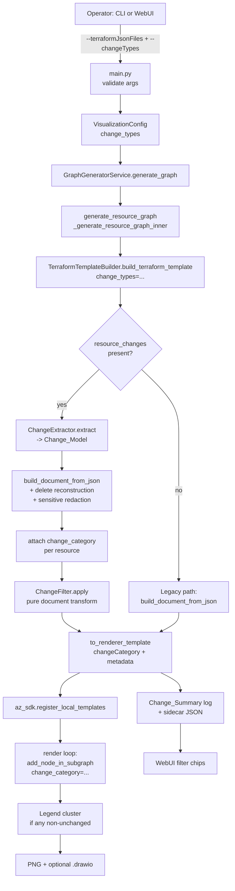
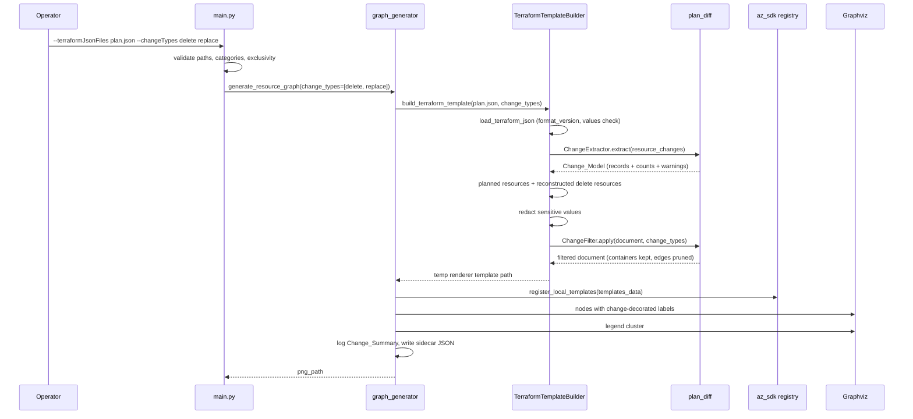
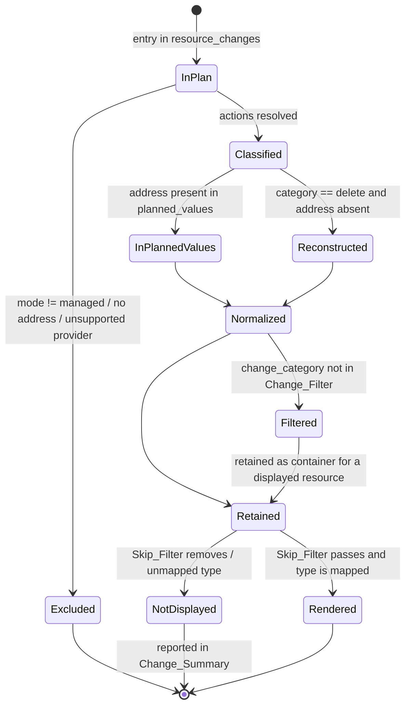

# Design Document

## Overview

This feature adds Terraform **plan diff** rendering to CloudHorus without altering any existing behaviour. The operator supplies a `terraform show -json` plan document through the already-existing `--terraformJsonFiles` argument (now also exposed in the WebUI). CloudHorus reads the plan's `resource_changes` array, classifies every managed resource into one of `create | update | replace | delete | unchanged`, reconstructs the resources that the plan will destroy (which `planned_values` omits), and carries that classification as **optional additive data** through the existing `LocalTemplateDocument → to_renderer_template() → Graph_Pipeline` contract.

The design is built around four grounded facts discovered in the codebase:

1. **`resource_changes` is completely unused today.** A repository-wide search for `resource_changes` under `src/` returns nothing. `TerraformTemplateBuilder.build_document_from_json()` (src/core/terraform_builder.py) reads only `planned_values` / `values` and `configuration`. All change semantics are therefore new code, with no existing behaviour to preserve inside the change path.
2. **The renderer contract is a plain dict, tolerant of extra keys.** `LocalTemplateResource.to_renderer_resource()` emits `type`, `name`, `properties`, optional `dependsOn`, then any `extra_fields`. `LocalTemplateDocument.to_renderer_template()` emits `$schema`, `contentVersion`, `resources`, and `metadata` when non-empty. The graph pipeline (`_generate_resource_graph_inner` in src/core/graph_generator.py) reads resources with `resource["type"]`, `resource["name"]`, `resource.get("properties", {})`, `resource["dependsOn"]` — it never enumerates keys. An extra `changeCategory` key is invisible to every legacy path.
3. **The registered template dict survives end to end.** `az_sdk.register_local_templates()` stores each template dict verbatim in `_template_mappings["templates"]`, and `get_template_data_for_resource_group()` returns that same dict to the render loop. So `metadata` written by the builder is readable at node-render time without new plumbing.
4. **Node styling is confined to one function.** Every resource node in the diagram is created by `add_node_in_subgraph()` (src/utils/graph_utils.py), which sets `shape="none"` and an HTML-like `<TABLE>` label plus an `image` attribute. Change state is drawn on the **whole node**: a decorated node switches `shape` to `box`, gains `style="filled,rounded"`, a `color` border in the category's colour token, a `fillcolor` background in that colour blended 15% into white, and `penwidth=2`. Graphviz paints the fill before the icon, so the icon stays visible on top of the tint. The label additionally carries the Flag_Token, which is the non-colour cue. Requirement 8.6 (Draw.io keeps the same shape, icon, and container assignment) still holds because `graphviz2drawio` derives the Draw.io shape from the DOT `image` attribute rather than from DOT `shape`, so decorated and undecorated nodes both export as `shape=image` with the same embedded icon and the same container parent.

### Design goals and the non-breaking strategy

| Concern | Strategy |
| --- | --- |
| Legacy_Mode output identity | Every new parameter defaults to "off". `change_category` defaults to `None` on `LocalTemplateResource`, and `to_renderer_resource()` omits the key when `None`. `add_node_in_subgraph()` gains one keyword-only argument that, when `None` or `"unchanged"`, produces a byte-identical attribute dict. |
| CLI compatibility | Only one new argument, `--changeTypes` (`nargs="+"`, default `None` meaning "all categories"). No existing argument name, arity, or default changes. |
| Plan diff activation | Auto-detected from the presence of a `resource_changes` array in the supplied plan. No new mode string, no new dispatch branch in `main.py`'s mode selection: `local_template_mode` stays `"terraform-json"`. |
| Filtering | Applied as a **pure transform on the `LocalTemplateDocument`** before `to_renderer_template()`, so the graph pipeline receives an already-filtered ARM-shaped template and needs no filtering logic. |
| Change reporting | Carried in `metadata` (single source of truth), logged by the pipeline, and mirrored to a sidecar JSON next to the PNG for the WebUI to read. |

### Research notes that shaped the design

- **Terraform JSON plan representation.** In format version 1.x, `resource_changes[]` entries carry `address`, `module_address`, `mode` (`managed` / `data`), `type`, `name`, `provider_name`, and a `change` object with `actions`, `before`, `after`, `before_sensitive`, `after_sensitive`. The `actions` array is the authoritative signal: `["no-op"]`, `["create"]`, `["read"]`, `["update"]`, `["delete"]`, `["delete","create"]` (replace) and `["create","delete"]` (replace with `create_before_destroy`). Source: [Terraform JSON output format — Change representation](https://developer.hashicorp.com/terraform/internals/json-format). Content was rephrased for compliance with licensing restrictions.
- **`planned_values` is post-apply state.** It describes what the state will look like after apply, so resources that will be destroyed are absent. Their attributes exist only in `resource_changes[].change.before`. This is why delete nodes must be reconstructed (Requirement 3).
- **Sensitivity markers are structural, not scalar.** `before_sensitive` / `after_sensitive` mirror the shape of `before` / `after`, with `true` at sensitive leaves (and planned resources additionally carry `sensitive_values`). Redaction must therefore walk the mask in parallel with the value tree.
- **Accessibility.** Colour alone is insufficient for change encoding; WCAG 2.1 SC 1.4.1 (Use of Color) requires a non-colour cue. The Flag_Token (`+ ~ ± -`) rendered in the node label is that cue, which is also what makes a monochrome print readable (Requirement 5.9). Full WCAG validation would require manual testing with assistive technologies and expert review; this design only guarantees the dual-encoding mechanism.

## Architecture

### Where the new code lives

```
src/core/
  plan_diff.py          ← NEW  Change_Extractor, Change_Record, Change_Model, ChangeFilter, summary
  terraform_builder.py  ← EXTENDED  plan-aware document build + delete reconstruction + redaction
  graph_generator.py    ← EXTENDED  change-aware node styling hook, legend, summary logging, sidecar
src/utils/
  graph_utils.py        ← EXTENDED  add_node_in_subgraph(..., change_category=None)
  change_style.py       ← NEW  Change_Style table (colour token + Flag_Token) and label decoration
src/cloudhorus/models/
  local_template_document.py ← EXTENDED  optional change_category field
src/cloudhorus/models/configuration.py ← EXTENDED  change_types field
src/main.py             ← EXTENDED  --changeTypes, plan/source mutual exclusion message
cloudhorus_webui.py     ← EXTENDED  plan JSON picker, --terraformJsonFiles / --changeTypes marshalling,
                                    change summary reader
webui/index.html, webui/app.js ← EXTENDED  Terraform plan drop zone, change filter chips
```

### End-to-end flow



### Sequence for a plan diff run



### Decision log

| Decision | Alternatives considered | Rationale |
| --- | --- | --- |
| Filter on the `LocalTemplateDocument`, not on the DOT source | Post-process `dot.source` (like `_remove_stale_subnet_subgraphs`); filter inside the render loop | Document-level filtering is a pure function over a small dataclass list — testable, idempotent, order-independent by construction (Requirements 12.3–12.5, 12.9). Post-processing DOT is regex surgery on 2 600 lines of layout logic and would risk the legacy paths. |
| Encode change state on the whole node: `shape=box` + `color` border + tinted `fillcolor`, with the Flag_Token in the label | Border and colour inside the HTML label only (`<TABLE BORDER COLOR>`); a coloured halo node | A label-internal border wraps only the text, leaving the icon outside the coloured frame, which reads as a decorated caption rather than a decorated resource. Node-level styling surrounds icon and text together and lets the tint carry the category as a fill. Requirement 12.6 (DOT parity for unchanged) is unaffected because `unchanged`, `None`, and out-of-set categories never enter the decoration path. Requirement 8.6 (Draw.io shape/icon/container parity) is unaffected because `graphviz2drawio` reads the Draw.io shape off the DOT `image` attribute, not off DOT `shape` — measured, not assumed. Only `shape`, `style`, `color`, `fillcolor`, and `penwidth` are ever touched; `image`, `imagescale`, `imagepos`, `width`, `height`, `margin`, `fontsize`, `labelloc`, and `group` stay identical. |
| Decorate VNet and subnet **clusters** with `color` + tinted `bgcolor` + `penwidth=3` | Leave containers undecorated; synthesize a node per container | A VNet and a subnet carry a Change_Category and the Legend counts them, but they render as Graphviz clusters, so leaving them undecorated makes the Diagram contradict its own Legend. The cluster keeps its `style=dashed`, its label, its `fontsize`, and its layout keys; only the three colour keys change (`CLUSTER_DECORATION_KEYS`). The Flag_Token goes into the first cell of the cluster label that holds **no image**: Graphviz rejects a label cell mixing an image with text and fails the whole render, and a cluster label opens with the container icon. |
| Match Draw.io container cells by **label text** when re-applying cluster decoration | Reuse the existing positional `clustN` map | `fix_drawio_hierarchy` builds that map by enumerating every `subgraph cluster_*` occurrence in the DOT, but a cluster re-opened by the render pass is still one cell in the converter output (15 DOT blocks for 7 cells in the sample), so the positional map misassigns. Label-text matching, with ambiguous matches left undecorated, is correct for the decoration. The pre-existing positional map used for cluster bgcolor, icon, and geometry is untouched and still carries that defect. |
| Auto-activate plan diff from `resource_changes` | New `--terraformPlanFiles` argument or new mode string | Requirement 1.1 states activation follows from the file content on the existing argument. Avoids a fourth `local_template_mode` branch and keeps `--terraformJsonFiles` state-JSON behaviour unchanged. |
| Change_Model serialized into `metadata` | Global singleton; side-channel file only | `metadata` already travels through `register_local_templates` verbatim, and the round-trip requirement (12.7) needs an authoritative serialized form. Also gives the legend and the summary one source of truth. |
| WebUI filtering re-runs generation | Client-side masking of the PNG; SVG output with per-node toggling | The pipeline's only visual artifact is a Graphviz-laid-out PNG; hiding nodes client-side cannot re-run layout, and switching the viewer to SVG would change the legacy output contract (Requirement 8.5). Re-running with `--changeTypes` reuses the exact CLI semantics, so WebUI and CLI filtering are the same code path (Requirements 6.3, 6.9). A progress indicator covers the latency (Requirement 11.3). |
| Reuse `should_skip()` for undisplayed reporting | Re-implement the skip patterns | `utils.graph_utils.should_skip` is the Skip_Filter the render loop actually calls; reusing it keeps the Change_Summary honest about what the diagram omits (Requirement 7.2). |

## Components and Interfaces

### 1. `src/core/plan_diff.py` (new)

Pure, dependency-light module: no Graphviz, no Azure, no file I/O. It owns classification, the change model, filtering, and summary assembly.

```python
CHANGE_CATEGORIES: tuple[str, ...] = ("create", "update", "replace", "delete", "unchanged")
KNOWN_ACTIONS: frozenset[str] = frozenset({"create", "update", "delete", "no-op", "read"})
SUPPORTED_PROVIDER_NAMES: frozenset[str]   # mirrors terraform_builder._SUPPORTED_PROVIDER_NAMES

@dataclass(frozen=True)
class ChangeRecord:
    address: str                  # full Terraform address incl. module prefix
    category: str                 # one of CHANGE_CATEGORIES
    actions: tuple[str, ...]      # raw actions array, order preserved
    terraform_type: str = ""
    provider_name: str = ""

@dataclass
class ChangeModel:
    records: dict[str, ChangeRecord] = field(default_factory=dict)   # keyed by address
    counts: dict[str, int] = field(default_factory=dict)            # one entry per category
    warnings: list[str] = field(default_factory=list)

    def category_for(self, address: str) -> Optional[str]: ...
    def has_changes(self) -> bool: ...          # any record whose category != "unchanged"
    def present_categories(self) -> list[str]:  # categories with count > 0, canonical order
    def to_metadata(self) -> dict[str, Any]: ...      # {"counts": {...}, "records": [...]}
    @classmethod
    def from_metadata(cls, payload: dict[str, Any]) -> "ChangeModel": ...

class ChangeExtractor:
    def extract(self, resource_changes: Any) -> ChangeModel: ...
    def classify(self, actions: Any) -> tuple[str, tuple[str, ...]]: ...

class ChangeFilter:
    def __init__(self, selected: Iterable[str]) -> None: ...
    def apply(self, document: LocalTemplateDocument) -> LocalTemplateDocument: ...

def parse_change_types(raw: Optional[Sequence[str]]) -> list[str]: ...   # validation for --changeTypes
def build_change_summary(model, document, unmapped, skipped) -> ChangeSummary: ...
def format_change_summary(summary: ChangeSummary) -> list[str]: ...      # console lines
```

**Classification rules** (`classify`) — evaluated in this order, matching Requirement 2:

| Condition on `actions` | Category |
| --- | --- |
| contains both `create` and `delete` (either order) | `replace` |
| `["create"]` | `create` |
| `["update"]` | `update` |
| `["delete"]` | `delete` |
| `["no-op"]` or `["read"]` | `unchanged` |
| contains any value outside `KNOWN_ACTIONS` | `unchanged` + warning naming the value |
| `change` object missing, `actions` missing or not a list | `unchanged` + warning naming the address |

`extract()` iterates `resource_changes` once, skipping entries whose `mode != "managed"` (Requirement 2.1), whose `address` is missing (9.7), or whose `provider_name` is outside the supported azurerm names (9.4) — each exclusion logged at warning level. Duplicate addresses keep the first record and log the duplicate (2.10). `counts` is derived from the retained records so the sum always equals `len(records)` (2.11, 12.2). A non-list `resource_changes` yields an empty model plus a type-mismatch warning (9.8).

**`ChangeFilter.apply`** is a pure function returning a **new** document (inputs untouched), in four deterministic passes:

1. **Direct selection** — keep resources whose `change_category` is in `selected`. Resources with `change_category is None` (legacy) are always kept; the filter is a no-op when `selected == set(CHANGE_CATEGORIES)`.
2. **Container retention** (Requirement 6.11) — a resource of renderer type `Microsoft.Network/virtualNetworks` or `Microsoft.Network/virtualNetworks/subnets` that pass 1 dropped is re-admitted when a kept resource references it: by `dependsOn` resource-id expression, by a subnet-id-bearing property (`virtualNetworkSubnetId`, `subnet.id`, `agentPoolProfiles[].vnetSubnetID`, `ipConfigurations[].properties.subnet.id`, `gatewayIPConfigurations[].properties.subnet.id`), or by the `"<vnet>/<subnet>"` name relation. A retained subnet also re-admits its parent VNet.
3. **Embedded-subnet pruning** — subnets are rendered as clusters from the VNet's `properties["subnets"]` list (`_attach_subnets_to_virtual_networks` populates it). Dropping a subnet resource must also drop its entry from every VNet's `properties["subnets"]`, otherwise the cluster still renders.
4. **Edge pruning** (Requirement 6.7) — for each kept resource, drop `dependsOn` entries whose target resource id is not in the kept set, and drop subnet-id-bearing property keys that point at dropped subnets. This prevents Graphviz from materializing orphan root-level nodes, which is the same failure mode the existing code guards against with `rendered_resource_groups`.

Passes 2–4 use only set membership and the kept set, so re-applying `apply` to its own output is a fixpoint (Requirement 12.4), and the result depends on `selected` as a set, not as a sequence (Requirement 12.5).

### 2. `src/core/terraform_builder.py` (extended)

Signatures change only by adding optional keyword arguments with legacy-preserving defaults.

```python
def load_terraform_json(self, terraform_json_file: str) -> Dict[str, Any]:      # unchanged
def build_document_from_json(
    self,
    terraform_json: Dict[str, Any],
    change_model: Optional[ChangeModel] = None,        # NEW
) -> LocalTemplateDocument: ...

def build_terraform_template(
    self,
    terraform_json_file: str,
    output_file: Optional[str] = None,
    change_types: Optional[Sequence[str]] = None,      # NEW
) -> Optional[str]: ...

# new private helpers
def _reconstruct_deleted_resources(self, terraform_json, change_model) -> List[Dict[str, Any]]: ...
def _redact_sensitive(self, values: Any, mask: Any) -> Any: ...
def _sensitive_mask_for(self, terraform_json, address, phase) -> Any: ...
```

`build_document_from_json` behaviour when `change_model` is provided:

1. Collect `planned_values` resources as today (`_collect_planned_resources`).
2. Append reconstructed delete resources for every `delete` record whose address is absent from `planned_values`, shaped exactly like a planned resource: `{address, mode: "managed", type, name, provider_name, values: change.before}` so `_normalize_resource` applies the same `_TERRAFORM_TO_RENDERER_TYPE` mapping, `_build_resource_name`, `_build_resource_properties`, and `_build_extra_fields` (Requirement 3.2). When `change.before` has no `name`, `_build_resource_name` already falls back to the entry `name`/`address`; the reconstruction passes the address so the fallback yields the address (Requirement 3.4).
3. Deduplicate by address before normalization, so a `replace` address present in both `planned_values` and a delete record produces exactly one entry, preferring the `planned_values` values (Requirement 3.3).
4. Redact sensitive leaves in `values` before normalization, using `after_sensitive` for planned resources (falling back to the planned resource's own `sensitive_values`) and `before_sensitive` for reconstructed delete resources; each flagged leaf becomes the literal `"(sensitive)"` (Requirement 10.1).
5. Set `resource.change_category = change_model.category_for(resource.address)`, defaulting to `"unchanged"` for resources present in `planned_values` but absent from `resource_changes`.
6. Extend `metadata` with `changeCounts`, `changeModel` (round-trippable payload), and `changesNotDisplayed`.

Dependency edges for reconstructed delete nodes reuse the existing configuration-driven mechanism: `_collect_configuration_resources` is keyed by address and still contains deleted addresses whenever the plan includes a `configuration` block, so `_collect_dependency_references` → `_references_to_depends_on` produces the same `[resourceId(...)]` expressions as for surviving resources, and references to addresses no longer in the document are naturally dropped because `address_index` lookup fails (Requirement 3.5). When the plan omits `configuration` (possible for `terraform plan -destroy` output), delete nodes render without dependency edges — a documented limitation reported through the Change_Summary rather than silently.

`build_terraform_template` orchestration:

```
data = load_terraform_json(path)                      # unchanged validation (9.1, 9.3)
raw_changes = data.get("resource_changes")
if raw_changes is None:
    document = build_document_from_json(data)         # exact legacy path
else:
    model = ChangeExtractor().extract(raw_changes)    # empty list -> empty model (9.5)
    document = build_document_from_json(data, change_model=model)
    document = ChangeFilter(parse_change_types(change_types)).apply(document)
json.dump(document.to_renderer_template(), ...)       # same temp-file contract
```

The module-level convenience wrapper `build_terraform_template(terraform_json_file, output_file=None, change_types=None)` keeps its existing positional signature so the call in `graph_generator` stays source-compatible.

### 3. `src/cloudhorus/models/local_template_document.py` (extended)

```python
@dataclass
class LocalTemplateResource:
    ...                                        # existing fields unchanged, same order
    change_category: Optional[str] = None      # NEW, trailing, defaulted

    def to_renderer_resource(self) -> Dict[str, Any]:
        resource = {"type": ..., "name": ..., "properties": ...}
        if self.depends_on: resource["dependsOn"] = self.depends_on
        for key, value in self.extra_fields.items():
            if value is not None: resource[key] = value
        if self.change_category is not None:               # NEW
            resource["changeCategory"] = self.change_category
        return resource
```

The field is trailing and defaulted, so every existing positional/keyword construction in `terraform_builder.py` and `bicep_builder.py` compiles unchanged, and the emitted dict is key-for-key identical when the field is `None` (Requirements 4.2, 4.3, 8.1). `LocalTemplateDocument.to_renderer_template()` is untouched — it already forwards `metadata` when non-empty (Requirement 4.4).

### 4. `src/utils/change_style.py` (new)

```python
CHANGE_STYLES: dict[str, ChangeStyle] = {
    "delete":    ChangeStyle(color="#D13438", flag="-",  label="Delete"),
    "update":    ChangeStyle(color="#0078D4", flag="~",  label="Update"),
    "create":    ChangeStyle(color="#107C10", flag="+",  label="Create"),
    "replace":   ChangeStyle(color="#D13438", flag="±",  label="Replace"),
    "unchanged": None,     # explicit: no decoration
}

def resolve_style(change_category: Optional[str]) -> Optional[ChangeStyle]:
    """Return None for None/'unchanged'; log a warning and return None for unknown values."""

def decorate_label(label_html: str, style: ChangeStyle) -> str:
    """Wrap the existing HTML table label with a coloured border and prepend the Flag_Token."""

def legend_label(categories: Sequence[str], counts: Mapping[str, int]) -> str:
    """Build the Legend HTML table label."""
```

`resolve_style` is the single place that maps an out-of-set `changeCategory` to unchanged styling with a warning (Requirement 4.6).

### 5. `src/utils/graph_utils.py` (extended)

```python
def add_node_in_subgraph(
    subgraph, node_id, label, image_path, resource_type,
    group: str = "",
    change_category: Optional[str] = None,      # NEW, keyword-only in practice
) -> None:
```

The existing body is unchanged; a single guarded block runs after the current `node_label` is built:

```python
style = resolve_style(change_category)       # None for legacy / unchanged / unknown
if style is not None:
    node_label = decorate_label(node_label, style)
```

`node_attributes` (including `shape="none"`, `image`, `imagescale`, `imagepos`, `width`, `height`, `group`) is never touched, which is what makes the icon path/scale identical (Requirement 5.6), the Draw.io shape/icon/container parity hold (Requirement 8.6), and the DOT source byte-identical for an all-unchanged plan (Requirement 12.6). The mirrored helper in `src/cloudhorus/utils/graph_utils.py` receives the same optional parameter so the two copies stay in step.

Decorated label shape (delete example):

```
<<TABLE border='1' cellborder='0' cellspacing='0' color='#D13438'>
  <TR><TD><FONT COLOR='#D13438'><B>-</B></FONT> app-web</TD></TR>
  <TR><TD>sites</TD></TR>
</TABLE>>
```

The label carries only resource name, short resource type, and Flag_Token — no attribute values — which is how Requirement 10.2 is satisfied structurally rather than by filtering.

### 6. `src/core/graph_generator.py` (extended)

Four additive touch points inside `_generate_resource_graph_inner`, plus one new parameter on `generate_resource_graph`:

1. **Signature** — `change_types=None` added at the end of the keyword list of both `generate_resource_graph` and `_generate_resource_graph_inner`, forwarded to `build_terraform_template(terraform_json_file, change_types=change_types)` in the existing `local_template_mode == "terraform-json"` branch.
2. **Per-template change index** — after `template_data` is loaded, build `change_index: dict[tuple[str, str], str]` mapping `(resource_name, resource_type)` to `changeCategory`, and accumulate `aggregate_counts` / `aggregate_summary` across templates. The index is needed because the subnet placement loop works from `dependencies` keys (`(name, type, rg)`) rather than from resource dicts.
3. **Node creation** — the two real resource-node call sites pass the category:
   - resource-group level node (`add_node_in_subgraph(resource_group, resource_name + "-" + resourceGroup, ...)`) passes `resource.get("changeCategory")`;
   - subnet-placed node (`add_node_in_subgraph(subnet_subgraph, node_id, subnet_resource_name, ...)`) passes `change_index.get((subnet_resource_name, resource_type))`.
   DNS-zone, bastion, and route-table nodes are unchanged: those types are removed by the Skip_Filter or synthesized, and their changes are reported in the Change_Summary instead (Requirement 7.2).
4. **Legend and reporting** — after the tenant loop and before `dot.attr(...)`:
   - when `aggregate_counts` has any non-`unchanged` category, add a `cluster_change_legend` subgraph containing one HTML-label node listing each present category with its colour swatch, Flag_Token, and count (Requirements 5.7, 5.8);
   - log the Change_Summary lines through `logger.info` so they appear in both the CLI console and the WebUI console (Requirement 7.1);
   - write `azure_resources_<timestamp>.change-summary.json` into the existing `output_dir` next to the PNG.
   All four steps are inside `if use_local_template and local_template_mode == "terraform-json" and aggregate_counts:`, so Legacy_Modes emit no legend, no summary, and no sidecar (Requirements 7.6, 8.4).

### 7. `src/cloudhorus/services/graph_generator_service.py` and `configuration.py` (extended)

`VisualizationConfig` gains `change_types: Optional[List[str]] = None`; `GraphGeneratorService.generate_graph` gains `change_types: Optional[List[str]] = None` and forwards it. Both are trailing defaulted parameters, so existing constructor and call sites are unaffected.

### 8. `src/main.py` (extended)

```python
parser.add_argument(
    "--changeTypes", nargs="+", default=None,
    help="Terraform plan change categories to display: create update replace delete unchanged. "
         "Defaults to every category.",
)
```

Validation added to the existing argument-checking block:

- Terraform plan JSON and Terraform source directories selected together → log `Choose exactly one Terraform input: plan JSON or source directories` and `exit(1)` (Requirement 1.5). This check runs **before** the existing generic multi-mode message so the specific wording wins for the plan/source pair; the generic message still covers Bicep combinations.
- Missing plan path → the existing per-file `os.path.exists` loop already reports the path and exits non-zero (Requirement 1.6).
- `--changeTypes` values validated through `parse_change_types`; on an unknown value, log `Invalid --changeTypes value '<value>'. Accepted values: create update replace delete unchanged` and `exit(1)` (Requirement 6.10).
- `--changeTypes` supplied outside Terraform JSON mode → warning, no failure (keeps Requirement 8.2/8.3 semantics).
- `--scopeMetadataFiles` handling is untouched, so plan diff inherits Terraform JSON scope resolution verbatim (Requirement 1.7).

### 9. `cloudhorus_webui.py` (extended)

- `pick_files` gains a `"terraform-plan"` branch with file types `("Terraform Plan JSON (*.json)", "All Files (*.*)")` (Requirement 1.3).
- `_build_command`: the `mode == "terraform"` branch marshals whichever Terraform input the user picked —
  `terraformJsonFiles` → `--terraformJsonFiles`, else `terraformRootDirs` / `terraformVarFiles` as today — and appends `--changeTypes` when the selection is a strict subset of all categories. Today this branch only knows `--terraformRootDirs`, so plan JSON support is purely additive.
- New `read_change_summary(png_path) -> Optional[Dict]` reads the sidecar `*.change-summary.json` beside a generated PNG, mirroring the existing `find_drawio_file` pattern.
- New `rerun_with_change_types(args_json, change_types)` convenience wrapper that calls `start_generation` with `changeTypes` injected, used by the filter chips.

### 10. WebUI front end (extended)

- `webui/index.html`: inside the existing `#section-terraform-files` card, a third drop zone `#drop-terraform-plan` ("Select a Terraform plan JSON produced by `terraform show -json`") with `#file-list-terraform-plan`. The `main.tf` and `.tfvars` zones stay exactly as they are (Requirements 1.4, 8.8).
- A `#change-filter-panel` block in the viewer header area, hidden by default, holding one toggle chip per present category plus an "N changes not displayed" badge (Requirements 6.1, 6.2, 7.5).
- `webui/app.js`:
  - `state.terraformPlanFiles`, `state.changeTypes`, `state.changeSummary`;
  - `pickTerraformPlanFiles()` filtering to `.json`;
  - `validate()` rejects selecting both plan JSON and `main.tf` in the same run with the Requirement 1.5 message, before the subprocess starts;
  - `buildCommandArgs()` / `buildCommandString()` emit `--terraformJsonFiles` and `--changeTypes` so the command preview stays truthful;
  - `selectMode()` hides `#change-filter-panel` for `live`, `bicep`, and Terraform source selections (Requirement 8.4);
  - after a successful plan-diff run, `read_change_summary` populates the chips with every present category selected;
  - toggling a chip shows the existing progress indicator and re-runs generation with the new `--changeTypes` (Requirement 11.3); an empty selection shows the toast `No resources match the selected change types` and leaves the current PNG in `#viewer-img` untouched (Requirement 6.8).

## Data Models

### Change_Record and Change_Model

```python
ChangeRecord(
    address="module.app.azurerm_linux_web_app.api",
    category="replace",
    actions=("delete", "create"),
    terraform_type="azurerm_linux_web_app",
    provider_name="registry.terraform.io/hashicorp/azurerm",
)

ChangeModel(
    records={"module.app.azurerm_linux_web_app.api": ChangeRecord(...), ...},
    counts={"create": 3, "update": 1, "replace": 1, "delete": 2, "unchanged": 4},
    warnings=["Unrecognized action 'forget' for module.x.azurerm_storage_account.s"],
)
```

Invariant: `sum(counts.values()) == len(records)`, and `set(counts) == set(CHANGE_CATEGORIES)` (absent categories carry `0`).

### Serialized form inside the Renderer_Template

```json
{
  "$schema": "https://schema.management.azure.com/schemas/2019-04-01/deploymentTemplate.json#",
  "contentVersion": "1.0.0.0",
  "resources": [
    {
      "type": "Microsoft.Network/virtualNetworks",
      "name": "core-vnet",
      "properties": { "addressSpace": { "addressPrefixes": ["10.10.0.0/16"] },
                      "subnets": [ { "name": "app", "properties": { "addressPrefix": "10.10.1.0/24" } } ] },
      "changeCategory": "unchanged"
    },
    {
      "type": "Microsoft.Web/sites",
      "name": "api-web",
      "properties": { "virtualNetworkSubnetId": "[resourceId('Microsoft.Network/virtualNetworks/subnets', 'core-vnet', 'app')]" },
      "dependsOn": ["[resourceId('Microsoft.Network/virtualNetworks/subnets', 'core-vnet', 'app')]"],
      "location": "westeurope",
      "changeCategory": "delete"
    }
  ],
  "metadata": {
    "terraformVersion": "1.8.5",
    "formatVersion": "1.0",
    "changeCounts": { "create": 1, "update": 0, "replace": 0, "delete": 1, "unchanged": 3 },
    "changeModel": {
      "counts": { "create": 1, "update": 0, "replace": 0, "delete": 1, "unchanged": 3 },
      "records": [
        { "address": "module.app.azurerm_linux_web_app.api", "category": "delete",
          "actions": ["delete"], "terraformType": "azurerm_linux_web_app",
          "providerName": "registry.terraform.io/hashicorp/azurerm" }
      ]
    },
    "changesNotDisplayed": [
      { "address": "module.net.azurerm_network_security_group.app", "terraformType": "azurerm_network_security_group",
        "category": "update", "reason": "skip-filter" },
      { "address": "module.app.azurerm_cosmosdb_account.main", "terraformType": "azurerm_cosmosdb_account",
        "category": "create", "reason": "unmapped-type" },
      { "address": "data.azurerm_client_config.current", "terraformType": "azurerm_client_config",
        "category": "unchanged", "reason": "no-resource-entry" }
    ]
  }
}
```

`changeCategory` is present only when the resource carries one; `metadata.changeCounts` / `changeModel` / `changesNotDisplayed` appear only in Plan_Diff_Mode. `metadata.terraformVersion` and `metadata.formatVersion` keep the values and semantics they have today.

### Change_Summary (console + sidecar)

Console form, written through `logger.info`:

```
Terraform plan change summary
  create      3
  update      1
  replace     1
  delete      2
  unchanged   4
Changes not displayed (3)
  module.net.azurerm_network_security_group.app   azurerm_network_security_group   update    (filtered resource type)
  module.app.azurerm_cosmosdb_account.main        azurerm_cosmosdb_account         create    (unmapped type)
  data.azurerm_client_config.current              azurerm_client_config            unchanged (no diagram node)
```

Sidecar `azure_resources_<timestamp>.change-summary.json` carries the same information plus `presentCategories` and the `changeStyles` table, so the WebUI can render chips and legend swatches without duplicating the colour constants:

```json
{
  "counts": { "create": 3, "update": 1, "replace": 1, "delete": 2, "unchanged": 4 },
  "presentCategories": ["create", "update", "replace", "delete", "unchanged"],
  "notDisplayed": [ { "address": "...", "terraformType": "...", "category": "update", "reason": "skip-filter" } ],
  "changeStyles": { "delete": { "color": "#D13438", "flag": "-" }, "update": { "color": "#0078D4", "flag": "~" },
                    "create": { "color": "#107C10", "flag": "+" }, "replace": { "color": "#D13438", "flag": "±" } }
}
```

### Change_Style table

| Change_Category | Colour token | Flag_Token | Node decoration |
| --- | --- | --- | --- |
| `create` | `#107C10` | `+` | label table border + coloured flag |
| `update` | `#0078D4` | `~` | label table border + coloured flag |
| `replace` | `#D13438` | `±` | label table border + coloured flag |
| `delete` | `#D13438` | `-` | label table border + coloured flag |
| `unchanged` | — | — | none (legacy attributes and label) |

### Change_Filter

`Change_Filter` is a `frozenset[str]` subset of `CHANGE_CATEGORIES`, produced by `parse_change_types` from `--changeTypes` or from the WebUI chips. `None` means "every category", which short-circuits `ChangeFilter.apply` to an identity transform.

### State transitions of a plan resource



## Correctness Properties

*A property is a characteristic or behavior that should hold true across all valid executions of a system — essentially, a formal statement about what the system should do. Properties serve as the bridge between human-readable specifications and machine-verifiable correctness guarantees.*

This feature suits property-based testing because the change pipeline is a chain of pure transformations: `resource_changes` array → Change_Model → `LocalTemplateDocument` → filtered document → Renderer_Template → node attributes. Every stage is deterministic, input-driven, and cheap to run hundreds of times with Graphviz rendering mocked. The plan JSON input space (arbitrary action arrays, module-nested addresses, nested sensitive value trees, arbitrary dependency graphs) is exactly where generated inputs beat hand-written examples.

### Property 1: Classification totality and closure

*For any* `resource_changes` array whose entries carry an `address`, including entries with missing `change` objects, missing or non-list `actions`, empty action arrays, and action values outside the known set, the Change_Extractor assigns exactly one Change_Category drawn from {`create`, `update`, `replace`, `delete`, `unchanged`} to every managed entry it retains, leaves no retained entry unclassified, and preserves the raw `actions` value on the Change_Record.

**Validates: Requirements 2.2, 2.8, 9.6, 12.1**

### Property 2: Classification follows the action decision table

*For any* action array composed of values from {`create`, `update`, `delete`, `no-op`, `read`} in any order, the assigned Change_Category equals the reference decision table: `replace` when the array contains both `create` and `delete` in any order, otherwise `create` for `["create"]`, `update` for `["update"]`, `delete` for `["delete"]`, and `unchanged` for `["no-op"]` and `["read"]`.

**Validates: Requirements 2.3, 2.4, 2.5, 2.6, 2.7**

### Property 3: Count conservation

*For any* Change_Model produced from any `resource_changes` value, the sum of the per-category counts equals the number of Change_Records, and the count mapping has exactly one entry per Change_Category.

**Validates: Requirements 2.11, 12.2**

### Property 4: Extraction membership and address keying

*For any* `resource_changes` array, the Change_Model contains exactly one Change_Record per distinct address among the entries that are managed, carry an address, and declare a supported azurerm provider name; each record key equals the entry's full Terraform address verbatim including module prefixes; for duplicated addresses the retained record is the one derived from the first occurrence; and a `resource_changes` value that is not an array yields an empty Change_Model.

**Validates: Requirements 2.1, 2.9, 2.10, 9.4, 9.7, 9.8, 11.4**

### Property 5: Delete reconstruction completeness and address uniqueness

*For any* Plan_File, every address whose Change_Category is `delete` or `replace` and that maps to a supported renderer type appears exactly once among the resource entries of the Renderer_Template, and for `delete` addresses absent from `planned_values` the entry is derived from the change entry's `before` object, using the Terraform address as displayed name whenever `before` carries no `name`.

**Validates: Requirements 3.1, 3.3, 3.4**

### Property 6: Reconstruction uses the same normalization as planned values

*For any* Terraform resource value object, the resource entry produced by reconstructing it from a delete entry's `before` object is equal — in `type`, `name`, `properties`, and extra fields — to the entry produced by supplying the identical value object through `planned_values`.

**Validates: Requirements 3.2**

### Property 7: Dependency references of deleted resources are preserved

*For any* Plan_File whose configuration expresses references from deleted resources to other addresses, the `dependsOn` list of each reconstructed delete entry contains the resource-id expression of every referenced address that still yields a resource entry, and contains no expression for an address that yields none.

**Validates: Requirements 3.5**

### Property 8: Change_Model round trip through the Renderer_Template

*For any* Change_Model, serializing it into the Renderer_Template and parsing the template `metadata` back yields a Change_Model equal to the original, the per-category counts appear under the `metadata` key, and each resource entry carries `changeCategory` exactly when its resource holds a Change_Category and omits the key otherwise.

**Validates: Requirements 4.1, 4.2, 4.4, 12.7**

### Property 9: Legacy inputs produce an unchanged Renderer_Template

*For any* Bicep input, Terraform source input, or Terraform JSON document without a `resource_changes` array, the Renderer_Template produced with this feature present is equal to the Renderer_Template produced by the code path preceding this feature, key for key and value for value, including the `type`, `name`, `properties`, and `dependsOn` entries.

**Validates: Requirements 4.3, 8.1**

### Property 10: Node attributes outside the label are never modified

*For any* resource and any `changeCategory` value, including values outside the Change_Category set and the absent value, the node attributes other than `label` — `image`, `imagescale`, `imagepos`, `shape`, `labelloc`, `width`, `height`, `margin`, `fontsize`, `group` — are equal to the attributes the same resource receives in Legacy_Modes, and for the categories `unchanged` and absent the `label` is also equal.

**Validates: Requirements 4.5, 4.6, 5.5, 5.6, 8.6**

### Property 11: Change styling maps categories to colour and flag inside the label

*For any* resource carrying a Change_Category other than `unchanged`, the emitted node label contains the colour token and the Flag_Token of that category as defined by the Change_Style table (`create` → `#107C10` and `+`, `update` → `#0078D4` and `~`, `replace` → `#D13438` and `±`, `delete` → `#D13438` and `-`), and the Flag_Token appears as label text rather than only as a colour attribute.

**Validates: Requirements 5.1, 5.2, 5.3, 5.4, 5.9**

### Property 12: Legend presence and content follow the Change_Model

*For any* Change_Model, the Diagram contains a Legend exactly when at least one Change_Record has a Change_Category other than `unchanged`, and when present the Legend lists every Change_Category present in the Change_Model together with its colour token and Flag_Token.

**Validates: Requirements 5.7, 5.8**

### Property 13: Filter completeness

*For any* document carrying Change_Categories and any Change_Filter selection, the set of displayed non-container resources equals the union of the resources whose Change_Category belongs to the selection, and a selection containing every Change_Category present in the Change_Model displays the same resource set as an unfiltered run.

**Validates: Requirements 6.3, 6.6, 12.3**

### Property 14: Filter idempotence

*For any* document and any Change_Filter selection, applying the selection to the result of applying the same selection yields the same displayed resource set as applying it once.

**Validates: Requirements 6.4, 12.4**

### Property 15: Filter order independence

*For any* two Change_Filter selections containing the same Change_Categories in different order, the displayed resource set is the same for both selections.

**Validates: Requirements 6.5, 12.5**

### Property 16: Filter monotonicity

*For any* Change_Filter selection that excludes at least one Change_Category, the displayed resource count is less than or equal to the displayed resource count of the unfiltered run.

**Validates: Requirements 12.9**

### Property 17: Edge and container integrity after filtering

*For any* document and any Change_Filter selection, every dependency reference surviving in the filtered document resolves to a displayed resource, and every container of a displayed resource — its subnet and that subnet's virtual network, including the subnet entry embedded in the virtual network properties — is retained, while containers holding no displayed resource are removed together with their embedded entries.

**Validates: Requirements 6.7, 6.11**

### Property 18: Every change is either rendered or reported

*For any* Plan_File, each Change_Record whose Change_Category differs from `unchanged` is either present as a resource entry in the Renderer_Template or listed under `Changes not displayed` with its Terraform address, its Terraform type, and a reason drawn from {skip-filter, unmapped-type, no-resource-entry}; the Change_Summary reports the resource count of every Change_Category; and no Change_Summary is produced for Legacy_Mode inputs.

**Validates: Requirements 7.1, 7.2, 7.3, 7.4, 7.6**

### Property 19: Sensitive leaves are masked and non-sensitive leaves are untouched

*For any* Terraform value tree and any parallel sensitivity mask, every value whose mask leaf is `true` is replaced by the literal string `(sensitive)` in the Renderer_Template, and every value whose mask leaf is absent or `false` is preserved unchanged.

**Validates: Requirements 10.1**

### Property 20: Sensitive values never reach an output surface

*For any* Plan_File containing sensitive attribute values, none of those values appears in a resource node label, in the Change_Summary, in any log record written during the run, or in the Graphviz DOT source that feeds the Draw.io export, and each Plan_Diff_Mode node label contains only the resource name, the resource type, and the Flag_Token.

**Validates: Requirements 10.2, 10.3, 10.4, 10.5**

### Property 21: Unchanged plans render byte-identical DOT

*For any* set of Terraform resources, a Plan_Diff_Mode run whose change entries all resolve to the Change_Category `unchanged` produces Graphviz DOT source identical to the DOT source produced for the same resources in Terraform JSON mode without Plan_Diff_Mode.

**Validates: Requirements 12.6**

### Property 22: No unhandled failure for any JSON plan input

*For any* JSON document supplied as a Plan_File, including documents with unsupported `format_version` values, missing value sections, arbitrary `resource_changes` shapes, and arbitrarily nested attribute trees, CloudHorus either produces a Renderer_Template or raises `ValueError`, and never raises any other exception type.

**Validates: Requirements 9.1, 9.9, 12.8**

### Property 23: Plan diff activation and scope resolution parity

*For any* Terraform JSON document, Plan_Diff_Mode artifacts (`changeCategory` keys and `metadata.changeCounts`) appear exactly when the document contains a `resource_changes` array, and for any scope metadata input the resolved tenants, subscriptions, and resource groups are identical whether or not the document contains that array.

**Validates: Requirements 1.1, 1.2, 1.7**

## Error Handling

All plan-input failures follow the codebase's existing offline-input convention: the builder raises, the caller logs `CloudHorus Error: ...`, and `main.py` exits non-zero. `TerraformTemplateBuilder.build_terraform_template` keeps its current `except (FileNotFoundError, OSError, ValueError, json.JSONDecodeError)` guard returning `None`, and the graph generator keeps its existing `if not template_file: logger.error(...); return` branch — that path already produces a non-zero exit through `main.py`'s `if png_path is None: exit(1)`.

| Condition | Detection point | Behaviour | Requirement |
| --- | --- | --- | --- |
| Plan file path missing | `main.py` argument loop, `load_terraform_json` | Log the path, `exit(1)` | 1.6 |
| Plan JSON and Terraform source both selected | `main.py` mode detection, WebUI `validate()` | Log `Choose exactly one Terraform input: plan JSON or source directories`, `exit(1)` | 1.5 |
| `format_version` major ≠ 1 | `load_terraform_json` | `ValueError` naming the version, logged, non-zero exit | 9.1 |
| Text is not valid JSON | `json.load` in `load_terraform_json` | `JSONDecodeError` caught; log includes file path plus `e.lineno`/`e.colno`/`e.pos`; non-zero exit | 9.2 |
| Neither `planned_values` nor `values` | `load_terraform_json` | `ValueError` naming both keys, non-zero exit | 9.3 |
| `resource_changes` is not an array | `ChangeExtractor.extract` | Empty Change_Model, warning naming the observed type, rendering continues | 9.8 |
| `resource_changes` is an empty array | `ChangeExtractor.extract` | All resources `unchanged`, message `Plan contains no resource changes`, no Legend | 9.5 |
| Entry missing `address` | `ChangeExtractor.extract` | Entry excluded, warning, rendering continues | 9.7 |
| Entry missing `change` object | `ChangeExtractor.classify` | Category `unchanged`, warning naming the address | 9.6 |
| Unrecognized action value | `ChangeExtractor.classify` | Category `unchanged`, raw actions retained, warning naming the value | 2.8 |
| Duplicate address | `ChangeExtractor.extract` | First record retained, warning naming the address | 2.10 |
| Unsupported `provider_name` | `ChangeExtractor.extract` | Entry excluded from the model, warning naming the provider | 9.4 |
| `changeCategory` outside the set at render time | `resolve_style` | Unchanged styling, warning naming the value, rendering continues | 4.6 |
| Invalid `--changeTypes` value | `parse_change_types` via `main.py` | Log accepted values, `exit(1)` | 6.10 |
| Empty Change_Filter selection in the WebUI | `webui/app.js` | Message `No resources match the selected change types`, previous Diagram retained, no re-run | 6.8 |
| Delete node whose plan omits `configuration` | `build_document_from_json` | Node rendered without dependency edges, reported in the Change_Summary; no failure | 3.5 |
| Draw.io converter rejects the graph | existing `except (IndexError, AttributeError, KeyError)` in `graph_generator` | Warning, DOT file kept, PNG unaffected | 8.7 |
| Sidecar summary write fails | `graph_generator` | Warning only; PNG generation is never failed by reporting | 7.1 |

Two deliberate non-failures: an unmapped Terraform type keeps the existing `Terraform.Azurerm/<type>` fallback rather than erroring (the resource still renders, and its change is listed under `Changes not displayed` when the icon lookup yields no diagram node), and a plan whose changes all resolve to `unchanged` renders exactly like a state-JSON render rather than reporting an empty diff.

## Testing Strategy

### Library and layout

- **Property tests**: [Hypothesis](https://hypothesis.readthedocs.io/) added to the `dev` extra in `pyproject.toml` (`hypothesis>=6.100`). Property-based testing is never hand-rolled.
- Each correctness property is implemented by **exactly one** property-based test, configured with `@settings(max_examples=100)` at minimum, and tagged with a comment in the form:
  `# Feature: terraform-plan-diff-visualization, Property {number}: {property_text}`
- New test files follow the existing flat `tests/test_*.py` convention and reuse `tests/conftest.py` helpers (`DotAnalyzer`, `work_dir`, the Graphviz `render`/`unflatten` mocks) rather than introducing a parallel harness:

```
tests/
  test_plan_diff_extractor.py     # Properties 1-4, 22
  test_plan_diff_resources.py     # Properties 5-8, 19
  test_plan_diff_filter.py        # Properties 13-17
  test_plan_diff_rendering.py     # Properties 10-12, 20, 21
  test_plan_diff_reporting.py     # Properties 18, 23
  test_plan_diff_legacy_parity.py # Property 9
  test_plan_diff_cli.py           # example-based CLI and WebUI marshalling tests
  strategies/plan_json.py         # shared Hypothesis strategies
```

### Generators

A small strategy module keeps generated plans realistic while still hitting edge cases:

- `terraform_addresses()` — 0 to 3 `module.<name>.` prefixes plus `<azurerm_type>.<name>`, including names with dots, dashes, and non-ASCII characters.
- `action_arrays()` — the five known actions, permutations containing `create` + `delete`, empty arrays, arrays with duplicates, arrays containing unknown tokens, and non-list values.
- `resource_change_entries()` — `mode` in {`managed`, `data`}, optional `address`, optional `change`, provider names inside and outside the supported azurerm set, injected duplicate addresses.
- `azurerm_resource_values()` — mapped types (`azurerm_virtual_network`, `azurerm_subnet`, `azurerm_linux_web_app`, `azurerm_kubernetes_cluster`, `azurerm_private_endpoint`, …) and unmapped types, with realistic keys plus nested lists/dicts.
- `sensitive_masks()` — value trees paired with structurally aligned masks marking a random leaf subset, covering `before_sensitive`, `after_sensitive`, and `sensitive_values`.
- `plan_documents()` — assembles `planned_values`, `configuration` (with reference expressions between generated addresses), and `resource_changes` including delete-only addresses.
- `change_filters()` — every subset of `CHANGE_CATEGORIES`, including the empty set and the full set, plus shuffled sequences of the same subset for Property 15.
- For Property 22, `hypothesis.strategies.recursive` over JSON primitives generates arbitrary documents, including ones that are not objects at all.

### Unit and example-based tests

Kept deliberately small — property tests carry input coverage. Example tests cover only the criteria classified as EXAMPLE or EDGE_CASE in the prework:

- CLI: mutual-exclusion message and exit code (1.5), missing plan path (1.6), invalid `--changeTypes` value and accepted-value listing (6.10), `--changeTypes` default (8.3), argparse inventory snapshot over name/`nargs`/`default` for every pre-existing argument (8.2), output path pattern (8.5).
- Malformed input: truncated JSON reporting path and parse position (9.2), document lacking both value sections (9.3), empty `resource_changes` emitting `Plan contains no resource changes` (9.5).
- WebUI marshalling: `_build_command` emits `--terraformJsonFiles` and `--changeTypes` (1.3), keeps `--terraformRootDirs` behaviour for source-only selections (8.8), `read_change_summary` reads the sidecar; DOM-level assertions for chip rendering (6.1, 6.2), all-deselected message (6.8), undisplayed badge (7.5), filter panel hidden in Live/Bicep/Terraform-source modes (8.4), progress indicator during a filtered re-run (11.3).
- Real sample fixtures: a plan derived from `samples/terraform-modular/generated/network.plan.json` and `app.plan.json` extended with a `resource_changes` array covering all five categories, used as a regression anchor for the summary and legend text.

### Integration tests

- One end-to-end CLI run with `--changeTypes delete` against a fixture plan, asserting through `DotAnalyzer` that only delete resources and their retained containers appear (6.9).
- One or two Draw.io exports of a plan-diff diagram asserting a non-empty `.drawio` file (8.7). These stay outside the property suite because they exercise `graphviz2drawio`, not CloudHorus logic, and are slow.
- The existing suite under `tests/` runs unchanged in CI as the regression gate (8.9).

### Performance tests

Single-execution benchmarks, not property tests, because a 5 000-entry plan is expensive and the outcome does not vary meaningfully with input:

- Extraction of 5 000 managed change entries completes under 5 seconds (11.1).
- Diff-enabled versus diff-disabled generation of the same plan, asserting the added runtime of extraction, styling, and summary generation stays under 10 percent of total generation runtime (11.2).

### What is not covered by automated tests

Colour perception, legend legibility, and diagram aesthetics are outside automated verification; the design instead guarantees the mechanism (Flag_Token in the label) that makes the encoding readable without colour. Full WCAG conformance would require manual testing with assistive technologies and expert accessibility review.
